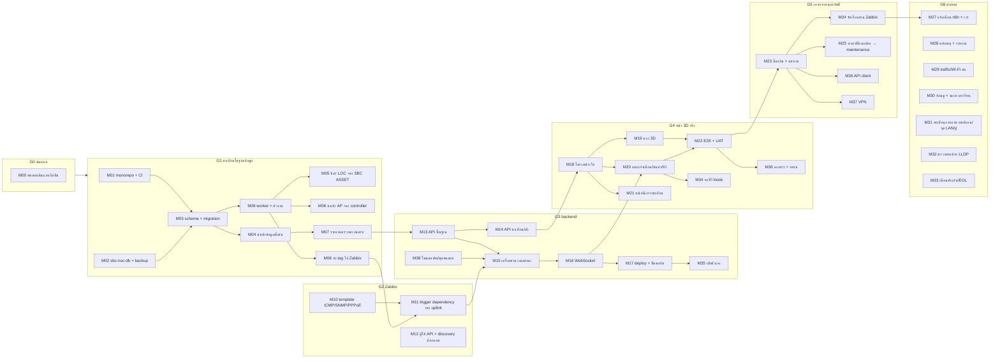

# sbc-noc — แผนงานแยกโมดูลตาม gate v2

- วันที่: 29 ก.ย. 2026
- อ้างอิง: baseline-v8 (gate G0–G6, ADR-001..017, ข้อกำหนดที่ไม่ใช่ฟังก์ชัน), sbc-noc-schema-design-v1.2 + schema v1.1
- v2 เพิ่มจาก v1: M34 จอทีวี kiosk, M35 เฝ้าตัวเอง, M36 เอกสารและอบรม, M37 เข้าสู่ระบบฉุกเฉิน + VPN, M38 โหมดสาธิต/ชุดข้อมูลทดสอบ; ขยาย M01 (ความปลอดภัยใน CI, branch protection) และ M17 (staging); G0 ปิดแล้ว
- ขนาดงานโดยประมาณสำหรับนักพัฒนา 1 คน: **S** ≤ 2 วัน, **M** 3–5 วัน, **L** 1–2 สัปดาห์ (ประมาณการคร่าวๆ ปรับหลังทำ G1 จริง)
- ผู้รับผิดชอบหลัก: **DEV** นักพัฒนา, **NET** ผู้ดูแลเครือข่าย/Zabbix, **FIELD** ทีมหน้างาน, **OWNER** ผู้ตัดสินใจ (STF-01)

## 1. หลักการแบ่งโมดูล

1. หนึ่งโมดูล = หนึ่งหน้าที่ชัดเจน ทดสอบและส่งมอบแยกได้ มีเงื่อนไข "เสร็จเมื่อ" ที่ตรวจได้
2. โมดูลอยู่ในโค้ดเป็นแพ็กเกจ/โฟลเดอร์ของตัวเองใน monorepo (`apps/*`, `packages/*`) หรือเป็นงานตั้งค่าในระบบที่มีอยู่ (Zabbix, NPM)
3. ทุกโมดูลที่เป็นโค้ดต้องมี unit test, ผ่าน CI, มีเอกสารสั้นใน `docs/modules/<รหัส>.md`
4. งานสามสายทำขนานกันได้: **สายพัฒนา** (DEV), **สาย Zabbix** (NET), **สายข้อมูลหน้างาน** (FIELD) มาบรรจบกันที่ G3/G4
5. จบแต่ละโมดูล รายงานผล แล้วรอยืนยันก่อนเริ่มโมดูลถัดไป

## 2. ภาพรวมโมดูลตาม gate

## 3. รายละเอียดโมดูล

### G0 ต้นแบบดีไซน์

| รหัส | โมดูล | ผู้รับผิดชอบ | ขนาด | ขึ้นกับ | ส่งมอบ | เสร็จเมื่อ |
|---|---|---|---|---|---|---|
| M00 | ทดสอบต้นแบบกับทีม | OWNER + ทีม 2–3 คน | S | – | สคริปต์ทดสอบ 5 งาน, แบบบันทึกผล, สรุปจุดติด | **ผ่านแล้ว 29 ก.ย. 2026** จุดปรับไปทำใน M20 ตรวจซ้ำใน M22 |

### G1 ทะเบียนในฐานข้อมูลพร้อม

| รหัส | โมดูล | ผู้รับผิดชอบ | ขนาด | ขึ้นกับ | ส่งมอบ | เสร็จเมื่อ |
|---|---|---|---|---|---|---|
| M01 | monorepo + CI พื้นฐาน | DEV | M | – | repo `sbc/sbc-noc` (pnpm + Turborepo), `apps/api`, `apps/worker`, `apps/web`, `packages/db`, `packages/shared`, `packages/ui`, ESLint/Prettier/tsconfig, Gitea Actions ตาม ADR-007 (งานเบาทุก push, งานหนักเฉพาะ PR/ออกรุ่น, ยกเลิกงานซ้ำ), ตรวจ secret หลุดด้วย gitleaks + pnpm audit (ADR-016), branch protection main, แม่แบบ PR + checklist นิยามเสร็จ, Renovate, `docs/architecture.md`, `docs/adr` (ADR-001..017), `.env.example` | push แล้ว CI ผ่าน; push ตรงเข้า main ไม่ได้ ต้องผ่าน PR + CI; ใส่ secret ปลอมใน commit ทดสอบแล้ว CI จับได้ |
| M02 | `sbc-noc-db` + backup | DEV + NET | S | – | compose service PostgreSQL 16, volume, network ภายใน, role `noc_migrate`/`noc_app`/`noc_read`, pg_dump รายวัน 14 วัน/รายสัปดาห์ 8 สัปดาห์, สคริปต์กู้คืน | ทดลองกู้คืนลงฐานทดสอบสำเร็จ; พอร์ตไม่เปิดออกนอก docker network |
| M03 | schema + migration | DEV | M | M01, M02 | Drizzle schema จาก v1.1, migration SQL, trigger audit/row_version, view `api.*`, ค่าตั้งต้น lookup, ทดสอบด้วย Testcontainers | migration รันบนฐานว่างผ่าน; ทดสอบ audit, `next_loc_code()`, uplink ซ้ำถูกปฏิเสธ |
| M04 | นำเข้าข้อมูลตั้งต้น | DEV | M | M03 | สคริปต์นำเข้า: อาคาร/ชั้น/ผังจากต้นแบบ, LOC 173 + LOC-187, อุปกรณ์ 49 + ISP 4, ไฟเบอร์ 8 เส้น + สี, VLAN, ทีม STF | จำนวนแถวตรงกับต้นทาง; รันซ้ำได้ไม่ซ้ำข้อมูล (idempotent) |
| M09 | worker + คิวงาน | DEV | S | M03 | `apps/worker` บน BullMQ + Redis (prefix `noc:`), ตารางเวลา, บันทึก `sync.runs`/`sync.issues` | งานตัวอย่างรันตามเวลา ล้มแล้วลองใหม่ มีผลใน `sync.runs` |
| M05 | ซิงก์ LOC จาก SBC ASSET | DEV | S | M09 | งานอ่าน LOC และจำนวนเครื่องห้องคอมฯ (อ่านอย่างเดียว) → `core.locations`, `core.location_metrics` | ห้องใหม่ใน SBC ASSET เข้าฐานภายในรอบซิงก์; ข้อมูลขัดแย้งเปิด `sync.issues` ไม่เขียนทับเอง |
| M06 | นำเข้า AP จาก controller | DEV + NET | M | M09 | ตัวเชื่อม UniFi, Omada, LINK (อ่าน) → `net.devices` role ap + `managed_by` + `external_refs` (MAC) | AP 132 ตัวอยู่ในฐาน; AP ที่ยังไม่ระบุห้อง/ชั้นขึ้นรายการให้คนเติม |
| M07 | รายงานตรวจความครบ | DEV | S | M04 | query/หน้าเรียบง่าย: ไม่มีชั้น/ห้อง, IP ซ้ำ, uplink ชี้อุปกรณ์ที่ไม่มี, วงวน uplink, อุปกรณ์ไม่มีใน Zabbix | รายงานเป็นศูนย์รายการผิดพลาด (เงื่อนไขปิด G1) |
| M08 | ส่ง tag ไป Zabbix + จับคู่ host | DEV + NET | M | M09, M12 | งานจับคู่ host (IP/ชื่อ) → `external_refs`; เขียน tag `building` `floor` `loc` `role` `uplink`; host ที่ไม่มีในทะเบียนเข้า "ไม่มีตำแหน่ง" | host เครือข่ายใน Zabbix มี tag ครบ 100%; รันซ้ำไม่เกิดการเปลี่ยนแปลงถ้าข้อมูลเท่าเดิม |
| – | ข้อมูลหน้างาน | FIELD | M | M04 | ลำดับห้องตามทางเดิน, ฝั่งทางเดิน, เลขห้อง, ยืนยันตำแหน่ง main/สวิตช์ | ห้องที่มีอุปกรณ์เครือข่ายมี `corridor_order` และ `verified_at` ครบ |

### G2 Zabbix พร้อมเป็นแหล่งข้อมูล (ทำขนานกับ G1 ได้)

| รหัส | โมดูล | ผู้รับผิดชอบ | ขนาด | ขึ้นกับ | ส่งมอบ | เสร็จเมื่อ |
|---|---|---|---|---|---|---|
| M10 | template และ item | NET | L | – | ICMP ทุก host (ping, loss, latency), SNMP บน CCR2116/CCR1036/SG6428X/main, item traffic พอร์ตไฟเบอร์ 8 เส้น, item PPPoE 4 ISP, ตั้งชื่อ host ตาม ADR-002 | ทุก host มีข้อมูลเข้า; traffic ไฟเบอร์และ ISP มีค่าจริง |
| M12 | ผู้ใช้ API + discovery ห้องคอม | NET | S | – | ผู้ใช้ API อ่านอย่างเดียว, ผู้ใช้สำหรับรับเรื่อง (ใช้ใน G5), token, discovery rule ICMP ช่วง IP ห้องคอมฯ (ADR-004), แนวทางใช้ maintenance | token ใช้งานได้; ตัวเลขเครื่องออนไลน์ห้องคอมฯ มีค่า |
| M11 | trigger dependency จาก uplink | DEV + NET | M | M08, M10 | งานใน worker สร้าง/อัปเดต trigger dependency ตามต้นไม้ uplink ในฐาน | ทดลองปิดอุปกรณ์ต้นทาง 1 ตัว Zabbix แสดงปัญหาเดียวที่ต้นเหตุ ลูกข่ายพักแจ้งเตือน |

### G3 backend sbc-noc (อ่านอย่างเดียว)

| รหัส | โมดูล | ผู้รับผิดชอบ | ขนาด | ขึ้นกับ | ส่งมอบ | เสร็จเมื่อ |
|---|---|---|---|---|---|---|
| M13 | API พื้นฐาน | DEV | S | M03, M07 | Fastify, zod, OpenAPI (`/docs`), `/health`, `/metrics`, log pino, ตั้งค่าจาก `.env` (ADR-005) | CI build image ได้; `/health` ตอบ; เอกสาร OpenAPI เปิดได้ |
| M14 | API ทะเบียนและผัง | DEV | M | M13 | endpoint อาคาร/ชั้น/ห้อง/อุปกรณ์/สาย/ผัง 3D/ค้นหา (อ่าน) พร้อม ETag | ข้อมูลที่หน้า 3D ต้องใช้ดึงได้ครบจาก API ไม่มีข้อมูลฝังในหน้าเว็บ |
| M15 | เครื่องคำนวณสถานะ | DEV | L | M11, M13 | ดึง problem/item จาก Zabbix ทุก 30 วินาที, รวมกับทะเบียน, คำนวณต้นเหตุ/ขาดจากต้นทาง/บำรุงรักษา, ความสดข้อมูล, snapshot ใน Redis, unit test ครอบคลุมกรณีต้นแบบทั้ง 4 สถานการณ์ | snapshot ตรงกับ Zabbix; เกิน 2 นาทีไม่ได้ข้อมูลแสดงสถานะค้าง |
| M16 | ข้อมูลสดผ่าน WebSocket | DEV | S | M15 | ช่อง WebSocket ส่ง snapshot + ส่วนที่เปลี่ยน, fallback ดึงทุก 30 วินาที | หน้าทดสอบเห็นสถานะเปลี่ยนภายใน 30 วินาทีหลัง Zabbix เปลี่ยน |
| M17 | deploy และความปลอดภัยพื้นฐาน | DEV + NET | M | M16 | compose staging (`noc-dev.sbc.lan`) และ prod (`noc.sbc.lan`) ตาม ADR-013, backup อัตโนมัติก่อน migrate (ADR-015), สแกน image ด้วย Trivy, CSP/rate limit, proxy host ใน NPM (access list วง management), log เข้า Loki, Zabbix web scenario เช็ก `/health`, ปิดพอร์ตที่เปิดตรงออกทุกวง | เงื่อนไขปิด G3 ใน baseline ครบ |
| M38 | โหมดสาธิต + ชุดข้อมูลทดสอบ | DEV | S | M13 | ย้ายสถานการณ์ตัวอย่าง 4 ชุดจากต้นแบบเป็น fixture ของเครื่องคำนวณสถานะ และเป็นโหมดสาธิตที่เปิดได้เฉพาะ dev/staging/ผู้ดูแล (ADR-014) | M15 ใช้ชุดนี้ทดสอบได้ครบ; หน้าจอโหมดสาธิตมีป้ายชัด ไม่ปนข้อมูลจริง |
| M35 | เฝ้าตัวเอง | NET + DEV | S | – (ส่วน Netwatch) / M17 (ส่วน metrics) | Netwatch บน CCR2116 ตรวจ sbc-ubuntu และ `/health` ส่ง Telegram ตรงจากเราเตอร์ (ADR-010); item ใน Zabbix เฝ้าคิว worker ค้างและงานซิงก์ล้ม | ปิด container NOC ทดลองแล้วได้ Telegram ภายใน 2 นาที; งานซิงก์ล้มขึ้นเป็นปัญหาใน Zabbix |

### G4 หน้า 3D ต่อข้อมูลจริง

| รหัส | โมดูล | ผู้รับผิดชอบ | ขนาด | ขึ้นกับ | ส่งมอบ | เสร็จเมื่อ |
|---|---|---|---|---|---|---|
| M18 | โครงหน้าเว็บ | DEV | M | M14 | React + Vite + TypeScript, ตัวแปรสี/ขนาดชุดเดียวจากต้นแบบ, กริด responsive, ฟอนต์ไทยโฮสต์เอง, TanStack Query, `packages/ui` | หน้าเปล่าพร้อมแผงทั้งหมดแสดงถูกทั้ง 3 ขนาดจอ |
| M19 | ฉาก 3D | DEV | L | M18 | ย้ายต้นแบบเป็นโมดูล Three.js แยกจาก React: อาคาร/พื้น/ไฟเบอร์/AP แบบ instancing/เอฟเฟกต์/โหมดประหยัด/แผนที่ย่อ อ่านผังจาก API | ภาพตรงกับต้นแบบ แต่ข้อมูลมาจากฐานจริง; ≥ 30 เฟรม/วินาทีบนเครื่องจอทีวี |
| M20 | แผงแจ้งเตือน ค้นหา ทีวี | DEV | L | M16, M18 | แจ้งเตือนรวมตามต้นเหตุ, ประวัติ, ไม่มีตำแหน่ง, ห้องคอมฯ, ค้นหาแบบรายการ, วิธีใช้/แนะนำการใช้งาน, โหมดทีวี (ยังรับเรื่องไม่ได้จนถึง G5) | ทุกฟีเจอร์ในต้นแบบทำงานกับข้อมูลจริง; สถานการณ์ตัวอย่างอยู่ในโหมดสาธิต (M38) เท่านั้น ไม่แสดงในหน้าจริง |
| M21 | หน้าจัดการทะเบียน | DEV | L | M14, M18 | เพิ่ม/แก้ อาคาร ห้อง อุปกรณ์ uplink, ออกเลข LOC, ตรวจความครบก่อนบันทึก, กันแก้ทับ (row_version), ดูประวัติการแก้ | เลิกใช้ Adminer ในการแก้ข้อมูลประจำวัน |
| M22 | E2E + UAT | DEV + OWNER | M | M19, M20 | Playwright ถ่ายภาพ 1366/1920/มือถือ, สคริปต์ UAT, ปุ่มลิงก์ Zabbix/Grafana/GLPI | เงื่อนไขปิด G4 ใน baseline ครบ |
| M34 | จอทีวีแบบ kiosk | DEV + NET | S | M20 | สเปกเครื่องขั้นต่ำ (mini PC มีกราฟิกในตัว, RAM 8 GB), Chrome/Edge โหมด kiosk เปิดเองเมื่อเปิดเครื่อง, IP จออยู่ใน access list (ไม่ต้องล็อกอิน, ADR-0023), โหลดหน้าใหม่เองเมื่อข้อมูลค้างหรือหน้าค้าง, ตั้งเวลาเปิด-ปิดจอ | ถอดปลั๊กแล้วเสียบใหม่ จอกลับมาแสดง NOC เองโดยไม่ต้องแตะ |
| M36 | เอกสารและอบรม | DEV + OWNER | M | M22 | คู่มือผู้ใช้ (ภาษาไทย), คู่มือผู้ดูแลทะเบียน, runbook (ฐานล่ม/กู้คืน, Zabbix API ล่ม, จอทีวีค้าง, ออกรุ่นและย้อนกลับ), อบรม STF-01..07 ด้วยโหมดสาธิต | ทีมทุกคนผ่านอบรมและทำงานหลักได้; runbook ทดลองทำตามจริงอย่างน้อย 1 ครั้ง |

### G5 การกระทำและสิทธิ์

| รหัส | โมดูล | ผู้รับผิดชอบ | ขนาด | ขึ้นกับ | ส่งมอบ | เสร็จเมื่อ |
|---|---|---|---|---|---|---|
| M23 | เข้าสู่ระบบ + บทบาท | DEV | M | M22 | บัญชีในเครื่อง (ADR-0023): CLI สร้าง/ตั้งรหัส/ปิดบัญชี, argon2id, session Redis 12 ชม., กันเดารหัส, บทบาท operator/admin, เลิกใช้ `REGISTRY_EDIT`, ค่าส่วนตัวผู้ใช้ | ผู้ไม่มีสิทธิ์เข้าหน้าจัดการ/รับเรื่องไม่ได้; จอทีวีเปิดได้โดยไม่ล็อกอิน |
| M24 | รับเรื่องผ่าน Zabbix | DEV | M | M23, M12 | รับเรื่อง/แก้ไข/ยกเลิก ด้วย event.acknowledge, บันทึก `audit.user_actions` | รับเรื่องใน NOC เห็นใน Zabbix และกลับกัน |
| M25 | งานเปลี่ยนแปลง → maintenance | DEV | M | M23 | หน้า `ops.changes` อนุมัติแล้วสร้าง maintenance ใน Zabbix อัตโนมัติ แสดงเป็นบำรุงรักษาในภาพ | งานที่อนุมัติไม่ทำให้เกิดแจ้งเตือนเท็จ |
| M26 | API client | DEV | S | M23 | ออก/เพิกถอน token ระบบอื่น (hash, scope, วันหมดอายุ) | n8n เรียก API ได้เฉพาะ scope ที่ให้ |
| M37 | VPN | NET | S | M23 | WireGuard บน CCR2116 สำหรับ STF (ADR-012); บัญชีฉุกเฉินไม่ต้องทำแล้ว (ADR-0023) | เข้าจากนอกโรงเรียนผ่าน VPN แล้วล็อกอินและรับเรื่องได้ |

### G6 แจ้งเตือนและต่อยอด (เลือกลำดับตามความสำคัญตอนถึง gate)

| รหัส | โมดูล | ผู้รับผิดชอบ | ขนาด | ขึ้นกับ | ส่งมอบ |
|---|---|---|---|---|---|
| M27 | แจ้งเตือน n8n + เวร | DEV + NET | M | M24, M26 | กติกาแจ้งเตือน, หน่วงเวลา, ยกระดับเมื่อไม่มีคนรับ, ตารางเวร, LINE/Telegram |
| M28 | คลังเหตุ + รายงาน | DEV | M | M15 | เก็บ `ops.incidents` ถาวร, ความพร้อมใช้รายเดือน, รายงานใน Metabase (รวม SLA ISP) |
| M29 | traffic และ Wi-Fi สด | DEV + NET | M | M10, M19 | ความเร็วก้อนข้อมูลตาม traffic จริง, จำนวนผู้ใช้ต่อ AP จาก controller |
| M30 | ย้อนดู + นอกเวลาเรียน | DEV | M | M28 | แถบเวลาย้อนดู, ปฏิทินโรงเรียน, โหมดนอกเวลาเรียน |
| M31 | ทะเบียนกายภาพ | DEV + FIELD | L | M21 | หน้าจัดการตู้ rack, สายและแกนไฟเบอร์, จุด LAN, SFP, UPS + การสำรวจหน้างาน |
| M32 | ตรวจสายด้วย LLDP | DEV + NET | M | M10, M31 | ดึงเพื่อนบ้าน LLDP/MNDP เทียบทะเบียนสาย เปิด `topology_mismatch` |
| M33 | เตือนประกัน/EOL | DEV | S | M21 | แจ้งเตือนประกันใกล้หมดและรุ่นหมดการสนับสนุน |

## 4. ลำดับที่แนะนำและงานขนาน

| ช่วง | สายพัฒนา (DEV) | สาย Zabbix (NET) | สายหน้างาน (FIELD) |
|---|---|---|---|
| 1 | M01, M02 | M12, M35 (Netwatch) | – |
| 2 | M03, M04, M09 | M10 | ลำดับห้องตามทางเดิน |
| 3 | M05, M06, M07, M08 | M10 (ต่อ) | ยืนยันตำแหน่ง main/สวิตช์ |
| 4 | M11, M13, M38, M14 | M11 (ร่วม) | – |
| 5 | M15, M16, M17, M35 (metrics) | ปิดพอร์ต (ร่วม M17) | – |
| 6 | M18, M19, M20, M21, M34 | สเปกเครื่องจอทีวี (M34) | – |
| 7 | M22, M36 → M23..M26, M37 | M24 ทดสอบร่วม, VPN (M37) | UAT, อบรม |
| 8 | G6 ตามลำดับความสำคัญ | M27, M29, M32 | M31 สำรวจสาย/จุด LAN |

เส้นทางวิกฤต: M01 → M03 → M09 → M08 → M11 → M15 → M16 → M20 → M22 → M23 → M24

## 5. รูปแบบการส่งมอบแต่ละโมดูล

1. เปิด branch `module/Mxx-ชื่อ` ใน Gitea
2. ส่งมอบ: โค้ด + test + `docs/modules/Mxx.md` (หน้าที่, การตั้งค่า, วิธีทดสอบ, ข้อจำกัด)
3. CI ผ่าน, ตรวจตามเงื่อนไข "เสร็จเมื่อ"
4. รายงานผลสั้นๆ และบันทึกใน baseline ถ้ามีการตัดสินใจใหม่ (เพิ่ม ADR)
5. รอยืนยันก่อนเริ่มโมดูลถัดไป
