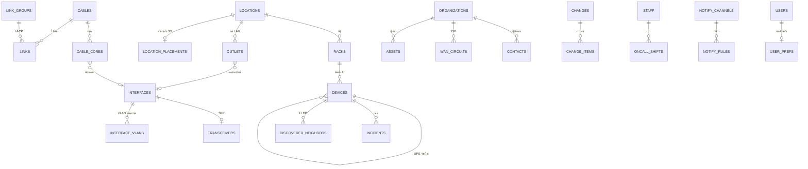

# sbc_noc — ออกแบบฐานข้อมูล v1.2 (G1)

- วันที่: 29 ก.ย. 2026
- ฐานข้อมูล: PostgreSQL 16, container `sbc-noc-db`, database `sbc_noc`
- ไฟล์ DDL: `sbc-noc-schema-v1.1.sql` (ร่าง ยังไม่ได้รันจริง) ใช้ได้ตามเดิม v1.2 เพิ่มเฉพาะการตัดสินใจในข้อ 5
- หลักการออกแบบ 8 ข้อจาก v1 ใช้เหมือนเดิม (แยก schema, external_refs, อ่านผ่าน api view, lookup table, UUID + รหัสคนอ่าน, ไม่ลบจริง + audit, attributes jsonb, สถานะสดอยู่ใน Zabbix)

## 1. สิ่งที่ v1 มองข้าม และเพิ่มใน v1.1

**ชั้นกายภาพ** (สิ่งที่ช่างต้องใช้หน้างาน)
- `net.racks` + ตำแหน่ง U ของอุปกรณ์ในตู้
- `net.cables` + `net.cable_cores`: สายจริงแต่ละเส้น จำนวนแกน แกนไหนใช้/ว่าง/เสีย ต่อพอร์ตไหน ค่าสูญเสียที่วัดได้ (ใช้กับแผนไฟเบอร์และการหาแกนสำรองตอนสายขาด)
- `net.outlets`: จุด LAN ผนัง/เพดาน → patch panel → พอร์ตสวิตช์ (ตอบคำถาม "จุดนี้ต่อพอร์ตไหน")
- `net.transceivers`: SFP/SFP+ ที่ใช้ ชนิด ความยาวคลื่น
- ไฟฟ้า: อุปกรณ์ระบุ UPS ที่จ่ายไฟ (`power_source_device_id`) และรับไฟ PoE หรือไม่; เพิ่มบทบาท `ups`, `pdu`, `patch_panel`, `odf`, `media_converter`, `camera`, `server`, `printer`

**ชั้นลอจิคัล**
- `net.interface_vlans`: VLAN ต่อพอร์ต (access / tagged / native)
- `net.link_groups`: LACP (เช่น CCR2116 ↔ CCR1036 4×1G)
- `net.ssids`: SSID, VLAN, กลุ่มผู้ใช้ (ครู/นักเรียน/แขก)
- `managed_by_device_id`: AP อยู่ใต้ controller ตัวไหน (UniFi / Omada / LINK) ใช้แยกเหตุ "controller ล่ม" กับ "AP ล่ม"
- `net.subnets` เพิ่มช่วง DHCP และเครื่องที่แจก DHCP; `net.ip_addresses` รองรับ IP ของเครื่องปลายทางในอนาคต

**วงจรชีวิตและสัญญา**
- `core.organizations` + `core.contacts`: ISP ผู้ผลิต ผู้ขาย ผู้รับเหมา พร้อมผู้ติดต่อ/hotline
- ครุภัณฑ์: วันซื้อ เลข PO ผู้ขาย วันหมดประกัน
- รุ่น: วันสิ้นสุดการสนับสนุน (EOL) ลิงก์ datasheet
- อุปกรณ์: เวอร์ชัน firmware, ช่องทางจัดการ, `secret_ref` (ชี้ไปที่เก็บรหัส ไม่เก็บรหัสจริง)
- ISP: เลขสัญญา วันเริ่ม/สิ้นสุด ค่าบริการรายเดือน เงื่อนไข SLA IP สาธารณะ
- งานซิงก์แจ้งเตือนประกันใกล้หมดและรุ่นหมดการสนับสนุนผ่าน `sync.issues`

**ปฏิบัติการ** (schema ใหม่ `ops`)
- `ops.incidents`: ประวัติเหตุระยะยาว (Zabbix ลบประวัติตามรอบ) มีต้นเหตุ ผู้รับเรื่อง สาเหตุ วิธีแก้ ticket GLPI เกิดในเวลาเรียนหรือไม่
- `ops.changes` + `ops.change_items`: งานเปลี่ยนแปลง/บำรุงรักษาที่วางแผน อนุมัติ และสร้าง maintenance ใน Zabbix ให้อัตโนมัติ
- `ops.oncall_shifts`: เวรของทีม STF
- `ops.notify_channels` + `ops.notify_rules`: แจ้งเตือนตามอาคาร/บทบาท/ความรุนแรง หน่วงเวลา ยกระดับเมื่อไม่มีคนรับ เฉพาะเวลาเรียน
- `ops.runbooks`: คู่มือแก้ปัญหาผูกกับบทบาท รุ่น หรืออุปกรณ์
- `ops.availability_monthly`: ความพร้อมใช้รายเดือนต่ออุปกรณ์ (รวมเฉพาะเวลาเรียน) ใช้รายงานและติดตาม SLA ของ ISP

**สถานที่และเอกสาร**
- `core.locations` เพิ่มเลขห้องหน้าห้อง ฝั่งทางเดิน ชื่ออังกฤษ ผู้ตรวจและวันที่ตรวจหน้างาน
- `core.buildings` เพิ่มชื่อเรียกอื่น (ค้นหา) และชื่ออังกฤษ
- `core.attachments`: รูปตู้ ผังชั้น แบบแปลนไฟเบอร์ ใบรับประกัน (ไฟล์อยู่ใน Drive)
- `core.calendar_events`: เวลาเรียน วันหยุด ช่วงสอบ (ใช้กับโหมดนอกเวลาเรียน กติกาแจ้งเตือน และรายงาน)

**คุณภาพข้อมูล**
- `verified_at` / `verified_by` บนห้องและอุปกรณ์
- `sync.discovered_neighbors`: เพื่อนบ้านที่อุปกรณ์เห็นจริง (LLDP/CDP/MNDP) เทียบกับทะเบียนสาย ถ้าไม่ตรงเปิด `topology_mismatch`
- `row_version`: หน้าจัดการตรวจว่ามีคนอื่นแก้ก่อนหรือไม่ ป้องกันบันทึกทับกัน

**หน้าจอและการใช้งาน**
- `viz.location_placements`: ตำแหน่งห้องในผัง (แผ่นห้องคอมฯ, ไฮไลต์ห้อง)
- `viz.displays`: ตั้งค่าจอทีวีแต่ละจอ (มุมกล้อง รอบวน เสียง โหมดประหยัด token เฉพาะจอแบบอ่านอย่างเดียว)
- `auth.user_prefs`: ค่าส่วนตัว (โหมดประหยัด คำค้นล่าสุด ผ่านการแนะนำแล้ว) ตามผู้ใช้ไปทุกเครื่อง
- `auth.api_clients`: token ของระบบอื่น (n8n, Portal, GLPI) เก็บเฉพาะ hash มีขอบเขตสิทธิ์และวันหมดอายุ
- `auth.user_roles` รองรับจำกัดสิทธิ์รายอาคาร
- `audit.user_actions`: บันทึกการกระทำ (รับเรื่อง ยกเลิก สร้าง maintenance ออก token)

**กติกาและนโยบาย**
- รหัสที่คนอ่านได้ไม่นำกลับมาใช้ซ้ำแม้ลบแล้ว
- ไม่เก็บรหัสผ่าน token ของ LINE/Telegram หรือ SNMP community ในฐาน เก็บเฉพาะตัวอ้างอิง
- ระยะเก็บข้อมูล: change_log 3 ปี, user_actions 1 ปี, sync.runs 90 วัน, เหตุและความพร้อมใช้รายเดือนเก็บถาวร

## 2. โครงสร้าง schema v1.1

| schema | ตาราง |
|---|---|
| `core` | source_systems, organizations, contacts, staff, sites, building_forms, buildings, floors, location_types, locations, location_metrics, external_refs, tags, entity_tags, attachments, calendar_events |
| `catalog` | device_roles, models |
| `asset` | assets |
| `net` | vlans, subnets, racks, devices, device_vlans, interfaces, transceivers, interface_vlans, ip_addresses, link_media, cables, cable_cores, link_groups, links, outlets, wan_circuits, ssids |
| `viz` | building_shapes, area_shapes, location_placements, device_placements, link_routes, view_presets, displays |
| `auth` | roles, users, user_roles, user_prefs, api_clients |
| `ops` | incidents, changes, change_items, oncall_shifts, notify_channels, notify_rules, runbooks, availability_monthly |
| `sync` | runs, issues, discovered_neighbors |
| `audit` | change_log, user_actions |
| `api` (view) | v_locations, v_devices, v_fiber_cores, v_outlets, v_incidents |

## 3. ความสัมพันธ์ส่วนที่เพิ่ม

## 4. สิ่งที่ตั้งใจไม่เก็บในฐานนี้

- สถานะสด ping traffic problem ประวัติรายนาที → Zabbix
- snapshot สด คิวงาน session → Redis
- ไฟล์จริง (รูป ผัง เอกสาร) → Drive, ฐานเก็บเฉพาะลิงก์
- รหัสผ่าน token community → ที่เก็บ secret
- เครื่องคอมพิวเตอร์ทุกเครื่อง → ยังเป็นของ SBC ASSET; ฐานนี้รองรับไว้ใน `asset.assets` เมื่อพร้อมรวม

## 5. การตัดสินใจ (ADR-001 ถึง ADR-006)

| # | เรื่อง | ตัดสินใจ | เหตุผล |
|---|---|---|---|
| ADR-001 | เลข LOC | LOC-187 = ห้อง server หลัก; ห้องใหม่ทุกห้องออกเลขจากฐานนี้ด้วย `core.next_loc_code()` เริ่ม LOC-188; SBC ASSET ขอเลขจากฐานนี้ | เลขไม่ชนกัน มีที่ออกเลขที่เดียว |
| ADR-002 | รหัสอุปกรณ์ | แยก 2 ช่อง: `code` รหัสภายในสั้นคงที่ (เช่น `m-s8`, `ap-s8-6-1`) ไม่เปลี่ยนตลอดอายุ; `hostname` ตั้งตามมาตรฐานชื่อของโรงเรียน เปลี่ยนได้ | ระบบอ้างอิงกันด้วยรหัสที่ไม่เปลี่ยน ส่วนชื่อที่คนเห็นปรับตามมาตรฐานได้โดยไม่กระทบการเชื่อม |
| ADR-003 | ขอบเขตครุภัณฑ์ | ระยะแรกเก็บเฉพาะอุปกรณ์เครือข่าย, UPS และ NVR; เครื่องคอมพิวเตอร์ซิงก์เข้ามาหลัง SBC ASSET ปิด Phase 2 (เปลี่ยนชื่อเครื่อง) | ไม่แย่งเป็นเจ้าของข้อมูลกับ SBC ASSET ระหว่างสำรวจ; โครงตารางรองรับไว้แล้ว |
| ADR-004 | เครื่องออนไลน์ห้องคอมฯ | ใช้ Zabbix network discovery สแกน ICMP ช่วง IP ของ VLAN ห้องคอมฯ นับเครื่องที่ตอบ → `core.location_metrics` (`pc_online`, source `zabbix`); ภายหลังเปลี่ยนเป็น agent ได้โดยไม่แก้โครงตาราง | ไม่ต้องลงโปรแกรมที่เครื่องนักเรียน ใช้ Zabbix ที่มีอยู่ |
| ADR-005 | ที่เก็บ secret | ระยะแรก: Gitea Actions secrets สำหรับ CI และไฟล์ `.env` บน sbc-ubuntu สิทธิ์ 600 นอก repo; ฐานเก็บเฉพาะ `secret_ref`; ประเมินที่เก็บ secret โดยเฉพาะ (เช่น Infisical หรือ Vault) ใน G5 | เริ่มได้ทันทีด้วยเครื่องมือที่มี และไม่ล็อกทางเลือกในอนาคต |
| ADR-006 | รูปแบบรหัสป้าย | สายไฟเบอร์ `FO-<ต้นทาง>-<ปลายทาง>-<NN>` เช่น `FO-B2-BA-01`; สาย LAN ระหว่างตึก `CU-...`; ตู้ `RK-<อาคาร>-<ห้อง>-<NN>` เช่น `RK-B2-SRV-01`; จุด LAN `<อาคาร>-<ชั้น>-<เลขห้อง>-<NN>` เช่น `B2-3-2310-05`; ถ้าหน้างานมีป้ายรูปแบบเดิมอยู่แล้ว เก็บป้ายเดิมใน `attributes.legacy_label` และใช้รูปแบบนี้กับป้ายใหม่ | มีมาตรฐานเดียวตั้งแต่เริ่ม ไม่ทิ้งข้อมูลป้ายเดิม |

ผลกระทบต่อ DDL: ไม่ต้องแก้โครงตาราง v1.1 (ช่อง `hostname`, `attributes`, `location_metrics`, `secret_ref` รองรับแล้ว)
