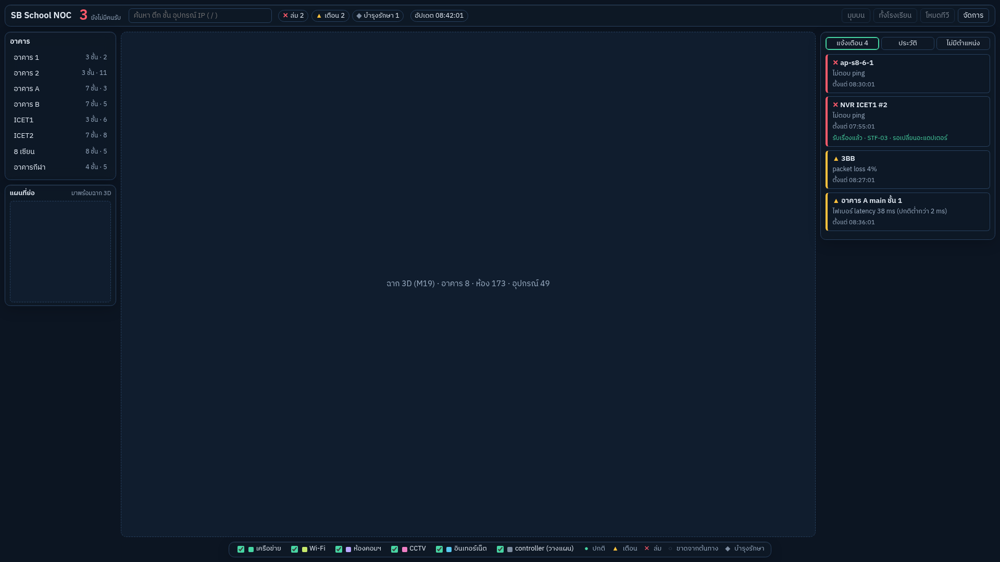
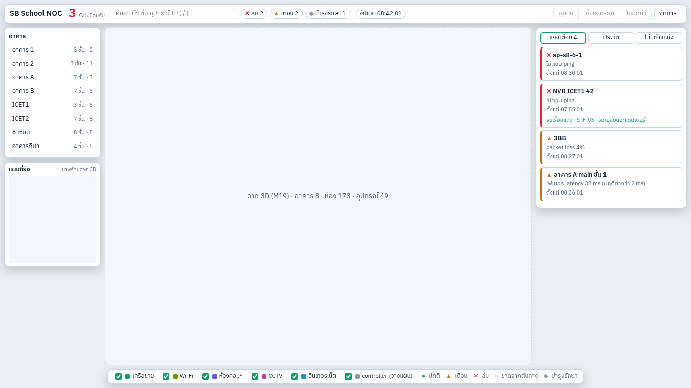
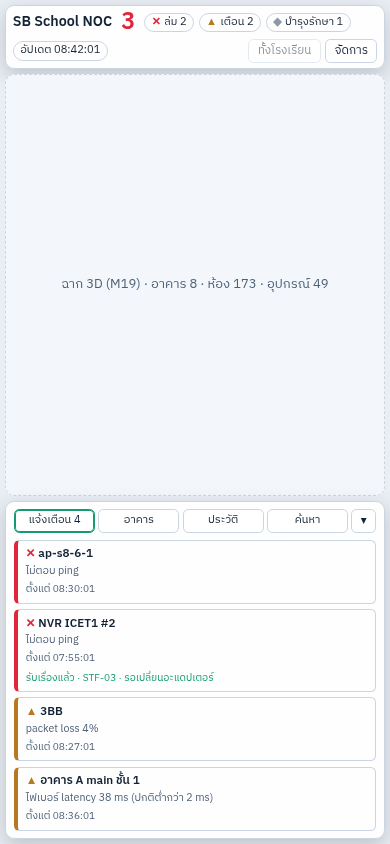

# M18 — โครงหน้าเว็บ

ตาม modules-by-gate-v2: React + Vite + TypeScript, ตัวแปรสี/ขนาดชุดเดียวจากต้นแบบ, กริด responsive, ฟอนต์ไทยโฮสต์เอง, TanStack Query, `packages/ui`

**เสร็จเมื่อ:** หน้าเปล่าพร้อมแผงทั้งหมดแสดงถูกทั้ง 3 ขนาดจอ

## สิ่งที่ทำ

| ไฟล์                                  | หน้าที่                                                                                                                                                                                    |
| ------------------------------------- | ------------------------------------------------------------------------------------------------------------------------------------------------------------------------------------------ |
| `packages/ui/src/tokens.css`          | ตัวแปรสีจากต้นแบบ (มืดเป็นค่าเริ่มต้น, สว่างตาม `prefers-color-scheme` หรือ `data-theme`), ปุ่ม/ชิป/แผงพื้นฐาน                                                                             |
| `packages/ui/src/index.ts`            | สัญลักษณ์สถานะ (ไม่ใช้สีอย่างเดียว), ชั้นแผนที่ + สี, breakpoint                                                                                                                           |
| `apps/web/src/shell/NocShell.tsx`     | กริดตามต้นแบบ: แถบบน, อาคาร + แผนที่ย่อ (ซ้าย), ช่องฉาก 3D (กลาง), แจ้งเตือน/ประวัติ/ไม่มีตำแหน่ง (ขวา), ชั้นแผนที่ + คำอธิบายสัญลักษณ์ (ล่าง), แผงแท็บล่างบนมือถือ, แถบเตือน "ข้อมูลค้าง" |
| `apps/web/src/shell/shell.css`        | 3 ขนาด: ≥ 1181 px, 901–1180 px (ย่อคอลัมน์ ซ่อนปุ่มรอง), ≤ 900 px (คอลัมน์เดียว + แผงแท็บ)                                                                                                 |
| `apps/web/src/data/api.ts`, `live.ts` | TanStack Query: ผัง (M14) revalidate ด้วย ETag ทุก 5 นาที; สถานะสด WebSocket + fallback (M16)                                                                                              |
| `apps/web/src/pages/AdminHome.tsx`    | `/admin` หลังบ้าน (M21 จะเติมหน้าจัดการทะเบียน); ตอนนี้มีสถานะ API, รายงานตรวจความครบ (M07), หน้าทดสอบสถานะสด (M16)                                                                        |

- ฟอนต์ IBM Plex Sans Thai จาก `@fontsource` (ไฟล์อยู่ใน bundle ไม่โหลดจาก Google) — ใช้ได้แม้อินเทอร์เน็ตล่ม
- route: `/` ผัง NOC, `/admin` หลังบ้าน (`react-router`); nginx ส่งทุก path ที่ไม่ใช่ไฟล์ไป `index.html` อยู่แล้ว
- แผงที่ใช้ข้อมูลจริงแล้ว: รายชื่ออาคาร (ชั้น/จำนวนอุปกรณ์), เหตุ + จำนวนที่ยังไม่มีคนรับ, ชิปจำนวนตามสถานะ, เวลาอัปเดต/ค้าง
- ยังเป็นที่ว่าง (มีป้ายบอก): ฉาก 3D + แผนที่ย่อ (M19), ค้นหา/ประวัติ/ไม่มีตำแหน่ง/โหมดทีวี (M20)

## ผลตรวจ 3 ขนาดจอ (Chromium, ข้อมูลผังจาก seed + สถานะสถานการณ์ `mixed`)

ไม่มี element ใดเลยขอบจอ ทั้ง 1920×1080 (โหมดมืด), 1366×768 (โหมดสว่าง), 390×844 (มือถือ)

**บน dev (2026-10-03):** ผู้ใช้ส่งภาพหน้าจอ 1348×637: อาคาร 8 พร้อมจำนวนอุปกรณ์จริง (เช่น 8 เซียน 33, อาคาร B 28), เหตุ 4 รายการจาก Zabbix (8 เซียน main ล่ม กระทบ 3), ชิป ล่ม 1/เตือน 3/ขาดจากต้นทาง 3, เวลาอัปเดตสด → เสร็จ
