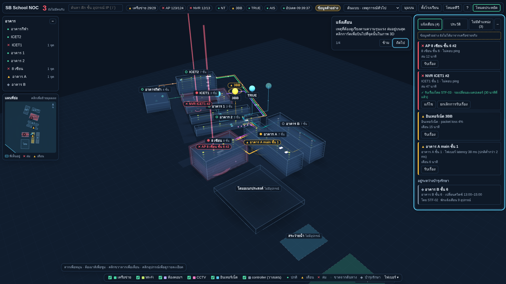
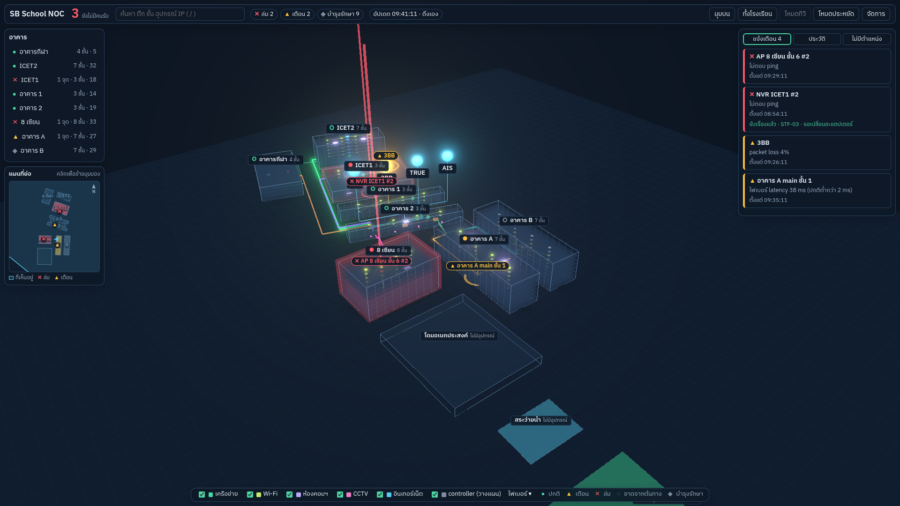
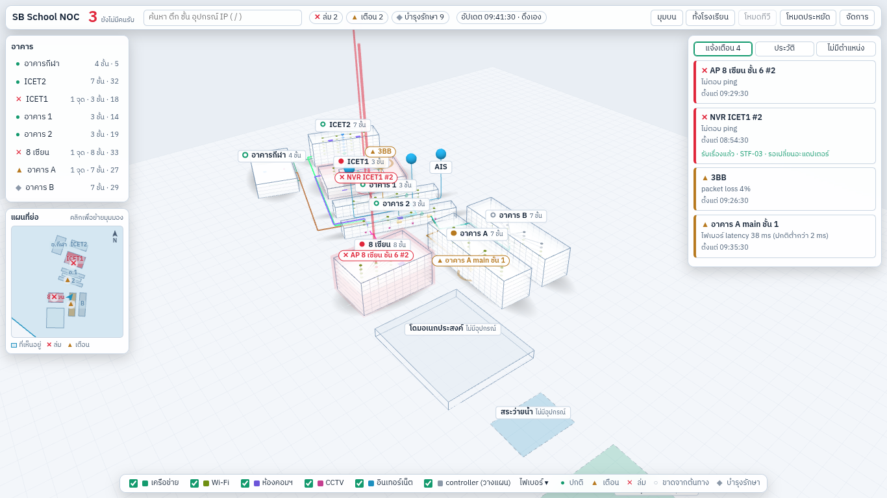
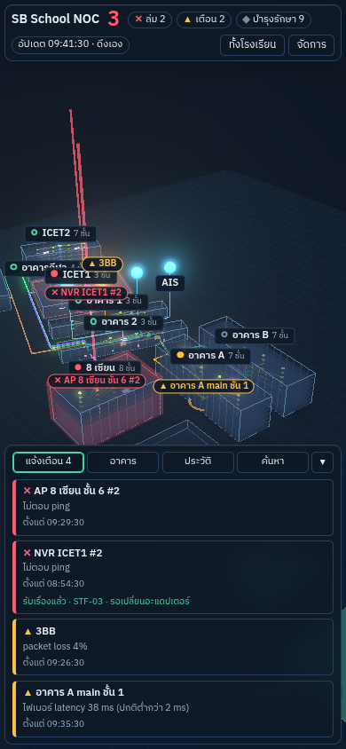
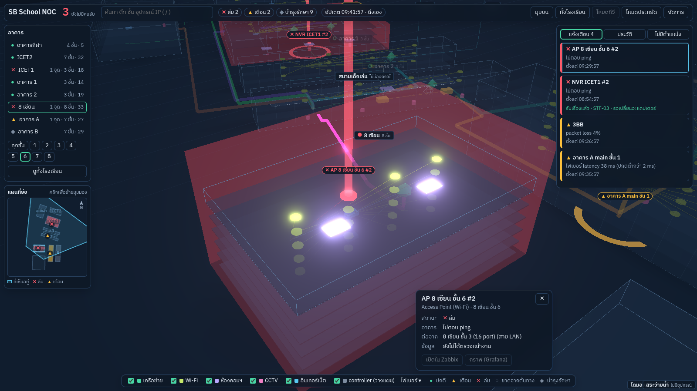
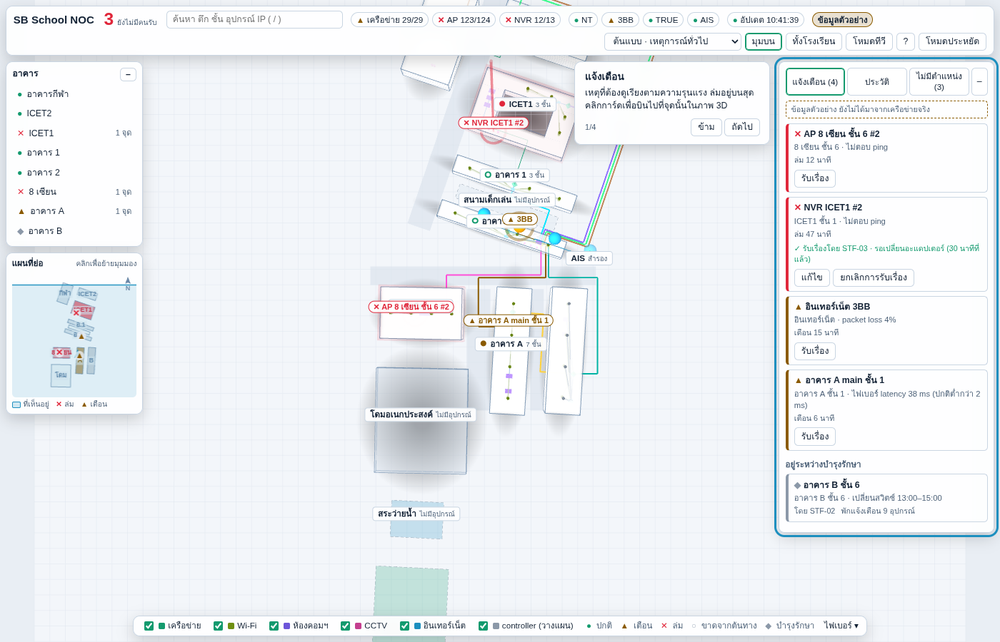
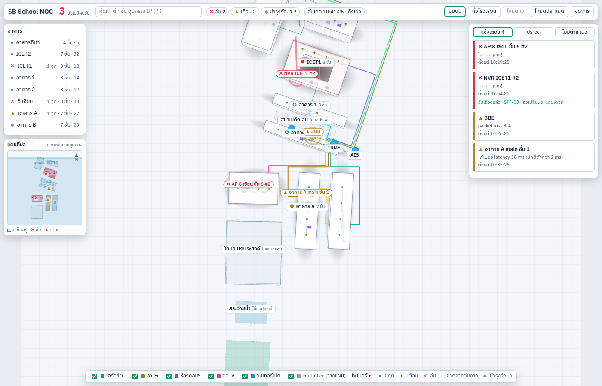

# M19 — ฉาก 3D

ตาม modules-by-gate-v2: ย้ายต้นแบบเป็นโมดูล Three.js แยกจาก React: อาคาร/พื้น/ไฟเบอร์/AP แบบ instancing/เอฟเฟกต์/โหมดประหยัด/แผนที่ย่อ อ่านผังจาก API

**เสร็จเมื่อ:** ภาพตรงกับต้นแบบ แต่ข้อมูลมาจากฐานจริง; ≥ 30 เฟรม/วินาทีบนเครื่องจอทีวี

## สิ่งที่ทำ

| ไฟล์                                  | หน้าที่                                                                                                                                                                                                                                             |
| ------------------------------------- | --------------------------------------------------------------------------------------------------------------------------------------------------------------------------------------------------------------------------------------------------- |
| `apps/web/src/scene/model.ts`         | ผัง (`/api/registry/layout`) → ตำแหน่งในโลก 3D: อาคารจาก `viz.building_shapes`, อุปกรณ์ (วางเองหรือวางอัตโนมัติ), ห้องคอมฯ, เส้นทางสาย — ไม่มี three.js จึงทดสอบใน node ได้                                                                         |
| `apps/web/src/scene/NocScene.ts`      | ฉาก three.js (r186) ล้วน ไม่พึ่ง React (กฎ dependency-cruiser `scene-no-react`): อาคารกระจก + แผ่นพื้นแต่ละชั้น, อุปกรณ์ตามรูปทรงต้นแบบ, AP เป็น `InstancedMesh` ชิ้นเดียว, ท่อไฟเบอร์ + ก้อนข้อมูลวิ่ง + หางแสง (instanced), bloom, ป้ายชื่อหลบกัน |
| `apps/web/src/scene/minimap.ts`       | แผนที่ย่อ: สีอาคารตามสถานะแย่สุด, พื้นที่ที่กล้องเห็น + ลูกศรทิศที่มอง, สัญลักษณ์เหตุ, ทิศเหนือ; คลิก/ลูกศรเพื่อย้ายมุมมอง                                                                                                                          |
| `apps/web/src/scene/palette.ts`       | สีฉากอ่านจากตัวแปร CSS ชุดเดียวกับแผง (`packages/ui/tokens.css`) — สลับธีมมืด/สว่างพร้อมกัน                                                                                                                                                         |
| `apps/web/src/shell/Scene3D.tsx`      | โหลดฉากแบบ lazy (three.js เป็น chunk แยก 160 kB gzip, `/admin` ไม่ต้องโหลด), ตรวจ WebGL, ส่งผัง/สถานะ/ชั้นข้อมูลเข้าฉาก                                                                                                                             |
| `apps/web/src/shell/NocShell.tsx`     | ฉากเต็มจอหลังแผงแบบต้นแบบ; เลือกอาคาร → บินไป + ปุ่มชั้น (ซ่อนชั้นที่สูงกว่า), "มุมบน", "ทั้งโรงเรียน", "โหมดประหยัด", คลิกการ์ดเหตุ → บินไปที่อุปกรณ์, แผงรายละเอียด, คำอธิบายสีไฟเบอร์จากทะเบียนสาย                                               |
| `packages/shared/src/registry.ts`, db | ลิงก์ใน layout มี `lane` และ `waypoints` จาก `viz.link_routes` (ไม่เปลี่ยน schema)                                                                                                                                                                  |

### ข้อมูลจริงเข้าฉากอย่างไร

- **อาคาร/พื้นที่:** ตำแหน่ง ขนาด มุม จำนวนชั้น ลานกลาง (ICET1 `shape.ring`) จากฐาน — อาคารที่ไม่มี shape ไม่วาด
- **อุปกรณ์:** ถ้ามี `viz.device_placements` (u, v) ใช้ตามนั้น; ไม่มี → วางอัตโนมัติเป็นแถวตามชั้น: สวิตช์/เราเตอร์ฝั่งหนึ่ง, NVR อีกฝั่ง, AP กลางอาคารใต้เพดานเรียงตามชื่อ, อาคารลานกลางวางบนปีกนอก; ISP เรียงเป็นลูกกลมเหนือ gateway; อุปกรณ์ที่ไม่มีอาคาร (นอกจาก ISP) ไม่วาด (M20 แสดงในรายการ)
- **ห้องคอมฯ:** ห้องประเภท `computer_lab` หรือชื่อขึ้นต้น "ห้องคอม" (SBC ASSET ตอนนี้ยังไม่ใส่ประเภท) — 16 ห้องตรงกับต้นแบบ; เครื่องออนไลน์ = 0 → แผ่นเป็นสีเทา
- **สาย:** ทุกลิงก์ใน `net.links`; สีไฟเบอร์จาก `viz.link_routes.color` (ไม่มี → ชุดสีต้นแบบ); ถ้า `viz.link_routes.waypoints` มีจุดหักเลี้ยว (`[x, z]` หรือ `[x, y, z]` พร้อมความสูงสาย) จะเดินตามนั้น — 12 เส้นของต้นแบบ (ไฟเบอร์ 8 + สาย LAN ข้ามอาคาร 2 + controller วางแผน 2) ใส่ไว้แล้ว; ในอาคารเดียวกันเป็นเส้นตรง; ลิงก์ข้ามอาคารที่ยังไม่มีจุด **เดินสายมุมฉากอัตโนมัติ**: ลองออกทุกด้านของอาคารต้นทาง × เข้าทุกด้านของปลายทาง แล้วเลือกเส้นที่ผ่านอาคารอื่นน้อยที่สุดและสั้นที่สุด
- **สถานะ:** จาก M16 (WebSocket/ดึงเอง) — สีอุปกรณ์/สาย, ก้อนข้อมูลหยุดเมื่อล่ม ช้าลงเมื่อเตือน, ลำแสง + วงคลื่นที่เหตุล่ม, วงคลื่นที่เหตุเตือน, เงาแดงคลุมอาคารที่มีอุปกรณ์ล่ม/ขาด, ป้ายลอยเหนืออุปกรณ์ที่มีเหตุ (คลิกแล้วบินไป), หน้าจอเป็นสีเทาเมื่อข้อมูลค้าง

### โหมดมืด/สว่าง

ปุ่ม "☀ สว่าง / ☾ มืด" บนแถบบน: ยังไม่เคยเลือก → ตามระบบ (`prefers-color-scheme`); เลือกแล้วตั้ง `data-theme` บน `<html>` และจำใน `localStorage` `noc-theme` (ใส่ก่อนวาดหน้าแรก ไม่กระพริบ) — แผงและฉาก 3D เปลี่ยนสีพร้อมกัน

### ประสิทธิภาพและโหมดประหยัด

- AP ทั้งหมดวาดเป็น `InstancedMesh` ชิ้นเดียว, หางแสงไฟเบอร์ (~220 ก้อน) อีกชิ้นเดียว, เส้น AP เป็น `LineSegments` ชิ้นเดียว
- โหมดประหยัด: ปิด bloom และหางแสง, pixel ratio ไม่เกิน 1.5 (ไม่ลดเหลือ 1 เพราะจอ 125%+ เบลอ); เปิดเองถ้า 5 วินาทีแรก (หลังโหลด 6 วินาที) ได้ต่ำกว่า 24 เฟรม/วินาที และผู้ใช้ยังไม่เคยเลือกเอง (จำใน `localStorage` `noc-eco-v2` เฉพาะที่ผู้ใช้เลือกจากเมนู; ที่เปิดเองมีผลแค่หน้านั้น, ไม่นับช่วงแท็บถูกซ่อนหรือหยุดวาดเกิน 1 วินาที)
- **วัดเฟรม:** เปิด `/?fps` จะมีชิป "xx fps" บนแถบบน (เฉลี่ยทุก 5 วินาที)
- `prefers-reduced-motion`: ไม่มีการบินกล้อง ก้อนข้อมูล และการกระพริบ

## ผลตรวจ (Chromium + SwiftShader ใน container, ผังจาก `infra/seed` + AP ตามกฎต้นแบบ 132 ตัว = 181 อุปกรณ์, สถานะสถานการณ์ `mixed` ของ M38)

- ไม่มี element ใดเลยขอบจอ ทั้ง 1920×1080 (มืด), 1366×768 (สว่าง), 390×844 (มือถือ)
- ทดสอบ: model 13 กรณี (วาง AP/ลานกลาง/วางเอง/ISP/ห้องคอมฯ/สายอ้อมอาคาร มุมฉาก/waypoints/ลิงก์ไปอุปกรณ์ไม่มีตำแหน่ง), หน้าเว็บ (ไม่มี WebGL → ข้อความแจ้ง, เลือกอาคาร → ปุ่มชั้น, คลิกเหตุ → แผงรายละเอียด), db บน PostgreSQL 16 จริง (layout มี `lane`/`waypoints`)
- เฟรมใน container เป็น 2–4 fps เพราะเรนเดอร์ด้วย CPU (SwiftShader) **ไม่ใช่ตัวเลขจริง** — ต้องวัดบนเครื่องจอทีวี

ต้นแบบ (ข้อมูลฝังในไฟล์) เทียบกับ M19 (ข้อมูลจากฐาน):







มุมบน โหมดสว่าง ข้อมูลเดียวกัน (seed + `routes-cli`): ต้นแบบ เทียบ M19




## ต่างจากต้นแบบ (ตั้งใจ)

- ~~เส้นทางสายไม่ตรงต้นแบบ~~ แก้แล้ว (ผู้ใช้แจ้งหลังทดสอบบน dev): ตำแหน่งอุปกรณ์ 45 ตัวและจุดหักเลี้ยวของสาย 12 เส้น **อ่านจากต้นแบบที่รันจริง** เก็บใน `infra/seed/prototype-routes.json` → `viz.device_placements` (mode `manual`) และ `viz.link_routes` (rule `prototype`) — เขียนเฉพาะที่ยังว่าง ไม่ทับค่าที่คนตั้ง; seed import เขียนให้เอง, ฐานที่ import ไปแล้วใช้ `routes-cli` (ขั้นตอนด้านล่าง)
- อุปกรณ์ที่ไม่อยู่ในต้นแบบ (AP จาก controller, อุปกรณ์ที่เพิ่มใน `/admin`) วางอัตโนมัติเป็นแถว; ลิงก์ใหม่ข้ามอาคารเดินสายอัตโนมัติ — ปรับได้ใน `viz.device_placements` / `viz.link_routes.waypoints` (ยังไม่มีหน้าแก้)
- ไม่วาดแถบถนน/ทางเดิน (ต้นแบบอิงรหัสอาคารตายตัว)
- ปุ่มเปิด Zabbix/Grafana ในแผงรายละเอียดยังปิด (M22); ค้นหา ประวัติ ไม่มีตำแหน่ง โหมดทีวี วิธีใช้ → M20

## ขั้นตอนบน dev (ผู้ใช้)

ตาม `docs/runbooks/github-to-gitea.md`: ดึง branch `claude/claude-md-m19-n9sxn2` เข้า `module/M19-3d-scene` → PR + CI → merge → อัปเดต dev แล้วเขียนเส้นทางต้นแบบลงฐาน dev:

```bash
/opt/sbc-noc/src/infra/scripts/pg-backup.sh
cd /opt/sbc-noc/src
docker compose --env-file /opt/sbc-noc/dev.env -f infra/compose/compose.dev.yml run --rm \
  -v /opt/sbc-noc/src/infra/seed:/seed:ro noc-dev-migrate node node_modules/@sbc-noc/db/dist/routes-cli.js /seed
```

`routes-cli` เขียนเฉพาะ `viz.device_placements` และ `viz.link_routes` ที่ยังว่าง ควรเห็น `placements written 45 of 45`, `routes written 12 of 12` (รันซ้ำได้ 0 of …); ถ้ามี `not in the registry: …` คืออุปกรณ์ที่ลบ/เปลี่ยนรหัสไปแล้ว ไม่เป็นไร

ควรเห็น: รีเฟรช `http://noc-dev.sbc.lan/` (layout แคช 5 นาที — กด Ctrl+F5) → ไฟเบอร์จากอาคาร 2 อ้อมปลายตึกฝั่งตะวันออกขึ้นไป ICET1/ICET2/อาคารกีฬา และลงใต้ไป 8 เซียน/A/B ตามต้นแบบ, ลูก ISP 4 ลูกเรียงเหนือห้อง server

**บน dev (2026-10-03):** ผู้ใช้วัดบนเครื่องจอทีวีได้ **44 fps** (≥ 30 ผ่าน); รอบแรกสายไม่ตรงต้นแบบ → เพิ่มเส้นทางจากต้นแบบ, merge PR #69, `routes-cli` เขียน placements 45/45 + routes 12/12 → **ผู้ใช้ยืนยันว่าภาพตรงต้นแบบ → เสร็จ**

บทเรียนการส่งงาน: branch ใน Gitea ต้องสร้างจาก `origin/main` (main ในเครื่องค้าง → PR ชน 9 ไฟล์, PR #68 ปิด); `/opt/sbc-noc/src` ต้องอยู่บน `main` ก่อน build dev
