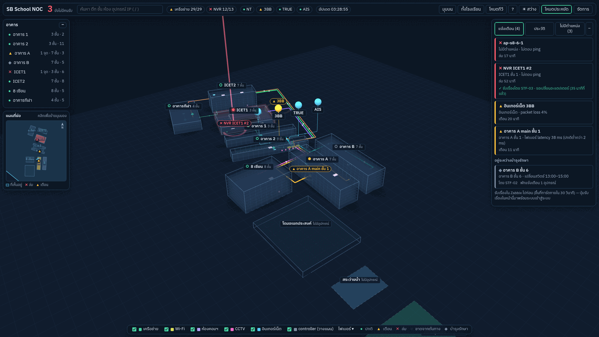
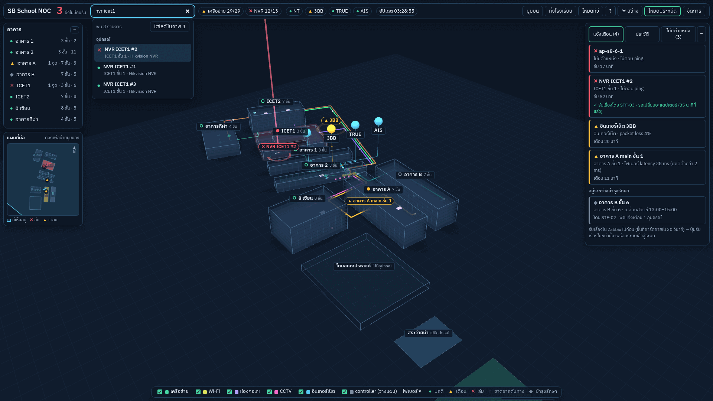
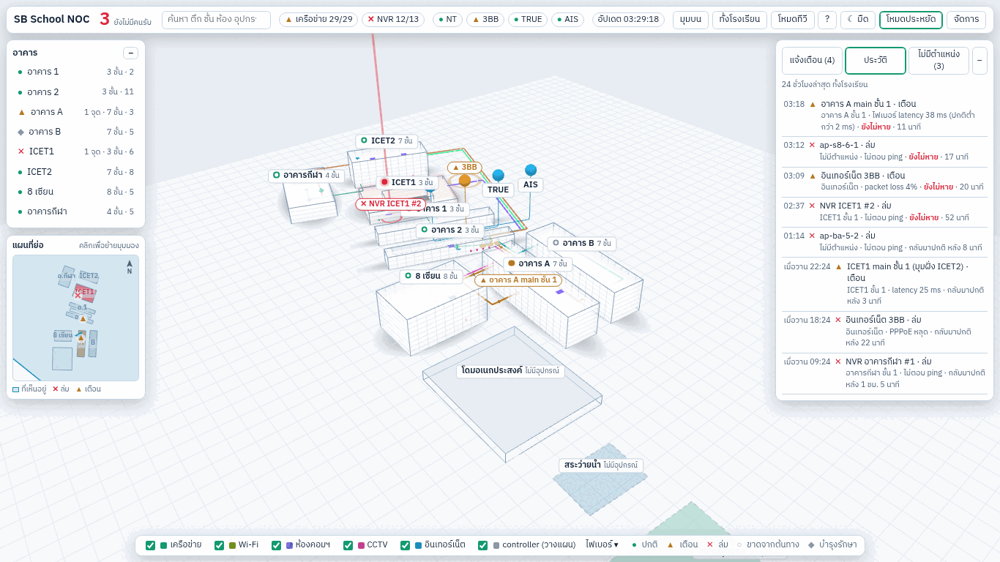
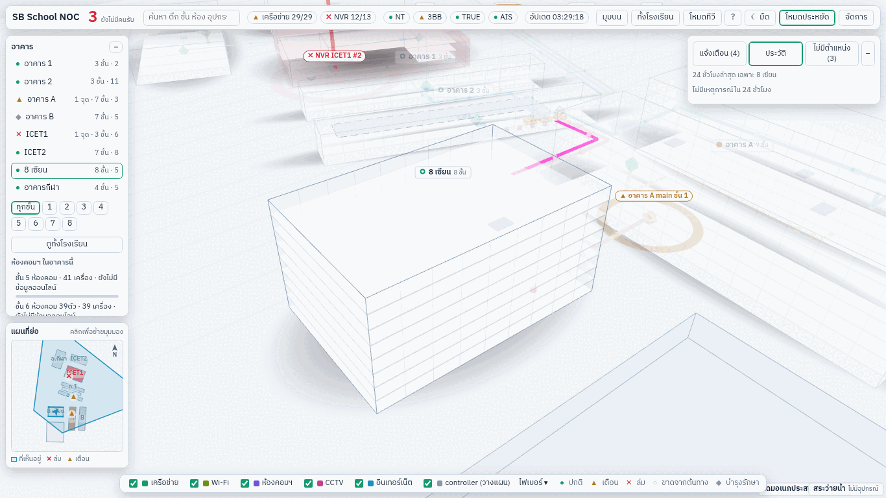
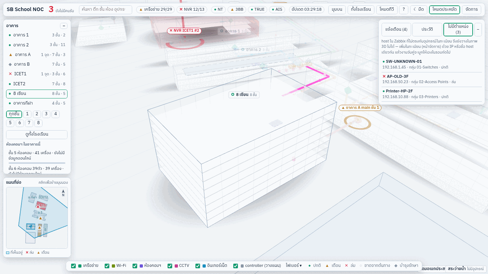
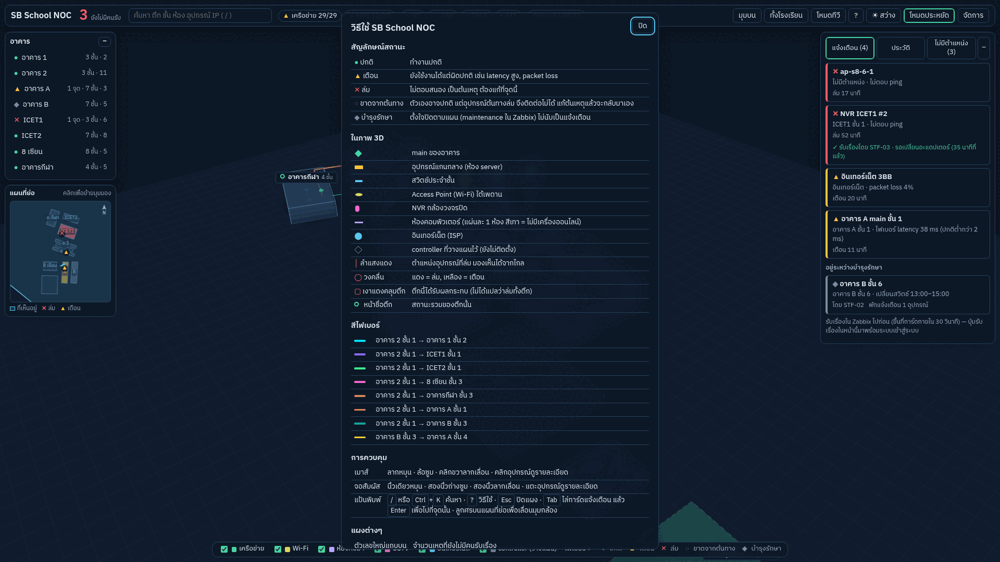
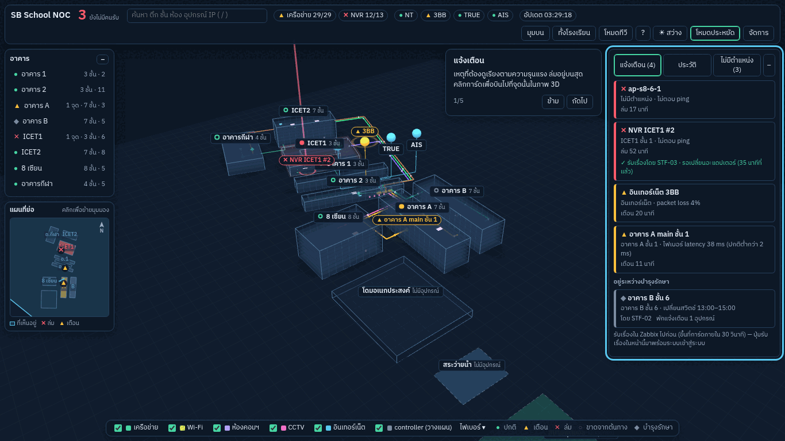
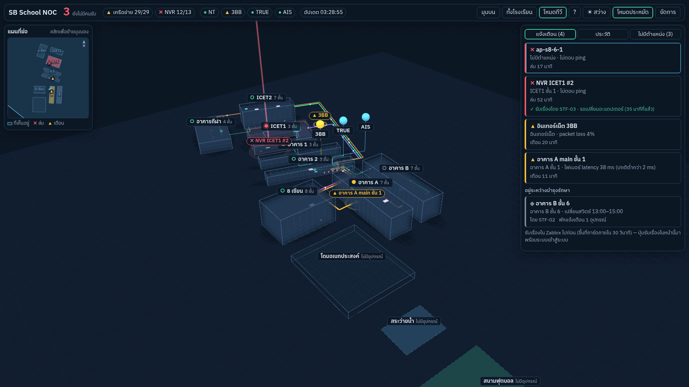
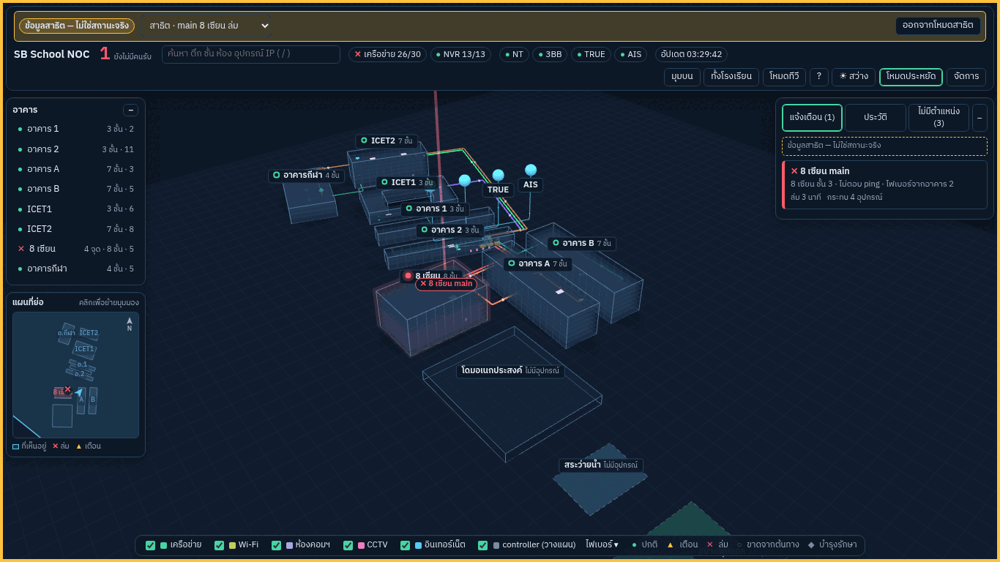
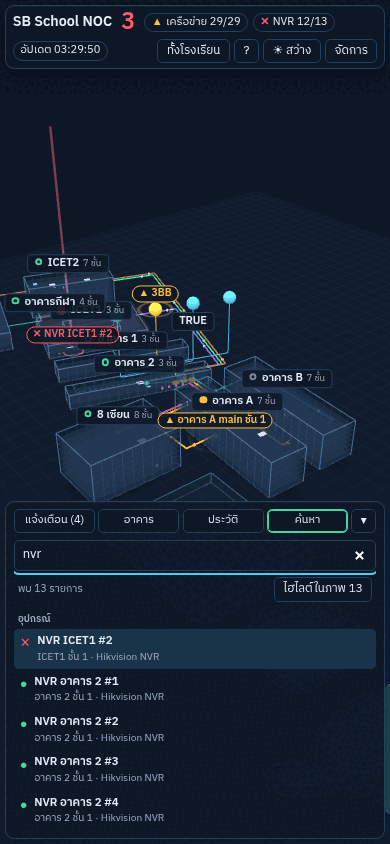

# M20 — แผงแจ้งเตือน ค้นหา ทีวี

ตาม modules-by-gate-v2: แจ้งเตือนรวมตามต้นเหตุ, ประวัติ, ไม่มีตำแหน่ง, ห้องคอมฯ, ค้นหาแบบรายการ, วิธีใช้/แนะนำการใช้งาน, โหมดทีวี (ยังรับเรื่องไม่ได้จนถึง G5)

**เสร็จเมื่อ:** ทุกฟีเจอร์ในต้นแบบทำงานกับข้อมูลจริง; สถานการณ์ตัวอย่างอยู่ในโหมดสาธิต (M38) เท่านั้น ไม่แสดงในหน้าจริง

## สิ่งที่ทำ

| ไฟล์                                                | หน้าที่                                                                                                                                                                                                                                                         |
| --------------------------------------------------- | --------------------------------------------------------------------------------------------------------------------------------------------------------------------------------------------------------------------------------------------------------------- |
| `packages/shared/src/status.ts`, `live.ts`          | snapshot มี `maintenance` (งานบำรุงรักษาจาก Zabbix: อุปกรณ์ ข้อความ ผู้ตั้ง); schema `statusHistorySchema` (เหตุ 24 ชม.), `unlocatedListSchema` (host ที่ไม่มีในทะเบียน)                                                                                        |
| `apps/worker/src/connectors/zabbix.ts`              | `problemEvents()` = `event.get` เหตุ 24 ชม. + เวลาหาย (recovery event), `hostsWithGroups()` = `host.get` พร้อมชื่อกลุ่ม                                                                                                                                         |
| `apps/worker/src/status/engine.ts`                  | ทุก 2 นาที (ไม่ใช่ทุก 30 วินาที) เขียน Redis `status:history`, `status:unlocated`; อ่านไม่ได้ (เช่นไม่มีสิทธิ์ `event.get`) → log เตือน สถานะหลักยังทำงานต่อ                                                                                                    |
| `apps/api/src/routes/status.ts`                     | `GET /status/history`, `GET /status/unlocated` (503 จนกว่า worker เขียนครั้งแรก); `/demo/scenarios/:name` ส่งประวัติ/ไม่มีตำแหน่งในรูปแบบเดียวกัน                                                                                                               |
| `apps/web/src/shell/search.ts`, `Search.tsx`        | ค้นหาแบบรายการ: อาคาร → ชั้น → ห้อง → อุปกรณ์, หลายคำพร้อมกัน, ชื่อเรียกตึก (แปดเซียน, icet1, ตึก a …), ประเภท (ap, nvr, กล้อง), สถานะ (ล่ม, เตือน, บำรุง), IP, LOC; ↑↓ Enter Esc, ค้นด่วน + ค้นล่าสุด 5 คำ, "ไฮไลต์ในภาพ" (ฉาก 3D จางทุกอย่างที่ไม่ใช่ผลค้นหา) |
| `apps/web/src/shell/panels.tsx`                     | แจ้งเตือน (ต้นเหตุ, ที่ไหน, นานเท่าไร, กระทบกี่ตัว, รับเรื่องแล้วโดย) + "อยู่ระหว่างบำรุงรักษา"; ประวัติ 24 ชม. กรองตามตึกที่เลือก; ไม่มีตำแหน่ง; ห้องคอมฯ ในตึก (ออนไลน์/ทั้งหมด + แถบ)                                                                        |
| `apps/web/src/shell/Help.tsx`                       | วิธีใช้ (ปุ่ม `?`/กด `?`) + แนะนำการใช้งาน 5 ขั้นครั้งแรก (จำใน `localStorage` `noc-tour`, ไม่ขึ้นในโหมดทีวี)                                                                                                                                                   |
| `apps/web/src/shell/tv.ts`                          | โหมดทีวี: เต็มจอ ตัวใหญ่ ซ่อนรายชื่ออาคาร/แถบชั้นข้อมูล, วนเหตุที่ยังไม่มีคนรับจุดละ 10 วินาที, ไม่มีเหตุ → ทั้งโรงเรียนหมุนช้า, เสียงเตือนเมื่อมีเหตุล่มใหม่; เปิดตรงด้วย `/?tv` (ใช้กับจอ kiosk M34)                                                          |
| `apps/web/src/data/extras.ts`, `shell/NocShell.tsx` | โหมดสาธิต `/?demo=<สถานการณ์>`: ใช้ข้อมูลจาก `/api/demo/*` อย่างเดียว (ไม่เปิด WebSocket จริง), แถบสีเหลือง "ข้อมูลสาธิต — ไม่ใช่สถานะจริง" + กรอบเหลืองรอบจอตลอดเวลา, เลือกสถานการณ์/ออก; ลิงก์ "โหมดสาธิต" ใน `/admin` ขึ้นเฉพาะเมื่อ api เปิด `DEMO_MODE`    |
| `apps/web/src/scene/NocScene.ts`                    | `highlight(codes)` สำหรับผลค้นหา, `setAutoRotate()` สำหรับโหมดทีวี                                                                                                                                                                                              |

อื่น ๆ จากต้นแบบที่เพิ่ม: ชิปแถบบนแบบต้นแบบ (เครือข่าย/AP/NVR ใช้ได้/ทั้งหมด + สถานะแย่สุด, ชิป ISP แต่ละราย คลิกแล้วบินไป), ย่อแผงอาคาร/แจ้งเตือน (–/+), แผงรายละเอียดมีแถว "บำรุงรักษา" และ "ล่ม 12 นาที", คีย์ลัด `/` หรือ `Ctrl+K` ค้นหา · `?` วิธีใช้ · `Esc` ปิดแผง

### ข้อมูลจริงมาจากไหน

| แผง          | แหล่ง                                                                                                                                                                   |
| ------------ | ----------------------------------------------------------------------------------------------------------------------------------------------------------------------- |
| แจ้งเตือน    | snapshot M15 (problem.get ทุก 30 วินาที) — รวมตามต้นเหตุ: ตัวที่อยู่ใต้ตัวที่ล่มเป็น "ขาดจากต้นทาง" ไม่ขึ้นการ์ดแยก; บำรุงรักษา = host ที่อยู่ใน maintenance ของ Zabbix |
| ประวัติ      | Zabbix `event.get` ย้อนหลัง 24 ชม. (severity Warning ขึ้นไป) — host ที่ไม่มีในทะเบียนก็แสดง (ชื่อ host, "ไม่มีตำแหน่ง"); คลังเหตุถาวร `ops.incidents` เป็นงาน M28       |
| ไม่มีตำแหน่ง | (1) host ใน Zabbix ที่ผู้ใช้ API มองเห็น แต่ไม่ได้จับคู่กับอุปกรณ์ในทะเบียน (M08) พร้อมกลุ่มและสถานะ (2) อุปกรณ์ในทะเบียนที่ยังไม่ระบุอาคาร (ไม่นับ ISP)                |
| ห้องคอมฯ     | ห้องจาก SBC ASSET (M05) + จำนวนเครื่องตามทะเบียน; "ออนไลน์" ยังไม่มีแหล่ง (discovery ห้องคอมฯ ของ M12 เลื่อนไป) → แสดง "ยังไม่มีข้อมูลออนไลน์"                          |
| รับเรื่อง    | อ่านจาก Zabbix (acknowledge) แสดง "✓ รับเรื่องโดย …"; ปุ่มรับเรื่องในหน้านี้ = M24 หลังมีการเข้าสู่ระบบ (G5) — ระหว่างนี้หน้าบอกให้รับเรื่องใน Zabbix                   |

สถานการณ์ตัวอย่าง 4 ชุดของต้นแบบ (ตัวเลือก "ต้นแบบ · …") **ไม่อยู่ในหน้าจริงแล้ว** อยู่ใน `/?demo=…` เท่านั้น

## ผลตรวจ

- ทดสอบอัตโนมัติ: web 41 (ค้นหา 8 กรณี: หลายคำ/ชื่อเรียก/ตัวเลขชั้น/IP/LOC/สถานะ/ISP/ลำดับกลุ่ม; หน้าจอ: ค้นแล้ว Enter เปิดรายละเอียด, ประวัติ + กรองตามตึก, ห้องคอมฯ, ไม่มีตำแหน่ง, วิธีใช้ `?`/`Esc`, แนะนำการใช้งานครบ 5 ขั้นแล้วจำ, โหมดทีวี, โหมดสาธิตมีแถบและไม่เปิด WebSocket, หน้าจริงไม่มีแถบสาธิต), worker (ประวัติจาก event, host ไม่มีตำแหน่ง เรียงล่มก่อน, รอบ 2 นาที + `event.get` ไม่มีสิทธิ์ก็ไม่ล้ม), api (history/unlocated 503 → ข้อมูล, demo รูปแบบเดียวกัน); integration บน PostgreSQL 16 จริงผ่าน
- หน้าจอจริงในเครื่อง (api + Redis + ฐาน seed, Chromium + SwiftShader): ไม่มี element ใดเลยขอบจอ ทั้ง 1920×1080 มืด, โหมดทีวี, 1366×768 สว่าง, โหมดสาธิต, 390×844 มือถือ (รวมแท็บค้นหา)












## ยังไม่ทำ / ต่างจากต้นแบบ

- ปุ่ม "รับเรื่อง/แก้ไข/ยกเลิก" ในการ์ด → M24 (ต้องมีผู้ใช้จาก M23); ตอนนี้แสดงผลรับเรื่องที่ทำใน Zabbix
- ประวัติไม่มีแถว "บำรุงรักษา" ย้อนหลัง (Zabbix ไม่เก็บเป็น event) — บำรุงรักษาที่กำลังเกิดอยู่แสดงในแท็บแจ้งเตือน
- ห้องคอมฯ ยังไม่มีจำนวนเครื่องออนไลน์ (รอแหล่งข้อมูล)
- เสียงเตือนโหมดทีวีต้องมีการกดหน้าจออย่างน้อยครั้งเดียว (นโยบายเบราว์เซอร์) — จอ kiosk (M34) ใช้ Chrome flag `--autoplay-policy=no-user-gesture-required`

## ขั้นตอนบน dev (ผู้ใช้)

**ก่อน deploy: ให้สิทธิ์ `event.get` กับผู้ใช้ API อ่านอย่างเดียว** (ไม่มี = แท็บประวัติขึ้น "ยังไม่มีประวัติ" และ log worker เตือน `history not readable`)
Zabbix → Users → User roles → role ของ `noc-api-read` → API methods (Allow list) → เพิ่ม `event.get` → Update

แล้วตาม `docs/runbooks/github-to-gitea.md`: ดึง branch `claude/youthful-cray-nqse0u` เข้า `module/M20-panels` → PR + CI → merge → อัปเดต dev (ข้อ 3)

ตรวจหลังอัปเดต (รอ worker รอบแรก ~2 นาที):

```bash
curl -s http://noc-dev.sbc.lan/api/status/history | head -c 300; echo
curl -s http://noc-dev.sbc.lan/api/status/unlocated | head -c 300; echo
docker logs --since 5m sbc-noc-dev-worker 2>&1 | grep -E "history|unlocated" | tail -3
```

ควรเห็น: JSON ขึ้นต้น `{"updatedAt":"…","hours":24,"events":[…` และ `{"updatedAt":"…","hosts":[…`; log worker ไม่มีบรรทัด `not readable`

ในเบราว์เซอร์ `http://noc-dev.sbc.lan/` (Ctrl+F5):

1. กด `/` พิมพ์ `nvr` → รายการ NVR พร้อมสถานะ; กด "ไฮไลต์ในภาพ" → ภาพจางเหลือเฉพาะ NVR, "ล้าง" กลับปกติ
2. แท็บ "ประวัติ" → เหตุ 24 ชม. จาก Zabbix; เลือกตึก → เหลือเฉพาะตึกนั้น
3. แท็บ "ไม่มีตำแหน่ง" → host ที่งาน `zabbix-match` (M08) ยังจับคู่ไม่ได้ (ชุดเดียวกับ `sync.issues` ชนิด `unmatched_host`)
4. เลือกตึกที่มีห้องคอมฯ (เช่น 8 เซียน) → "ห้องคอมฯ ในอาคารนี้" ใต้ปุ่มชั้น คลิกแล้วบินไปที่ห้อง
5. กด `?` → วิธีใช้; "เริ่มแนะนำการใช้งานอีกครั้ง" → 5 ขั้น
6. "โหมดทีวี" (หรือเปิด `http://noc-dev.sbc.lan/?tv` บนเครื่องจอทีวี) → เต็มจอ วนเหตุทุก 10 วินาที
7. `/admin` → ปุ่ม "โหมดสาธิต" → แถบเหลือง + กรอบเหลือง, เปลี่ยนสถานการณ์ได้, "ออกจากโหมดสาธิต" กลับหน้าจริง
