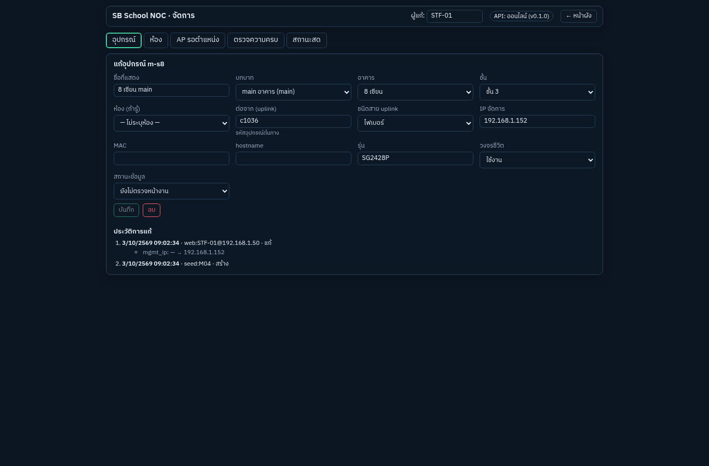
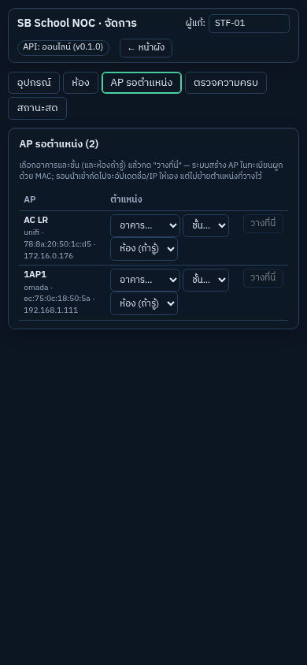

# M21 — หน้าจัดการทะเบียน

ตาม modules-by-gate-v2: เพิ่ม/แก้ อาคาร ห้อง อุปกรณ์ uplink, ออกเลข LOC, ตรวจความครบก่อนบันทึก, กันแก้ทับ (row_version), ดูประวัติการแก้ · **ย้ายมาทำก่อน M19 ตาม ADR-0020** (+ กำหนดตำแหน่ง AP ที่ยังไม่มีชั้น)

**เสร็จเมื่อ:** เลิกใช้ Adminer ในการแก้ข้อมูลประจำวัน

## หน้าจอ (`/admin`)

| เมนู         | ทำอะไรได้                                                                                                                                                            |
| ------------ | -------------------------------------------------------------------------------------------------------------------------------------------------------------------- |
| อุปกรณ์      | ค้นหา/กรองตามอาคาร บทบาท; แก้ชื่อ บทบาท ห้อง หรืออาคาร+ชั้น, ต่อจาก (uplink) + ชนิดสาย, IP, MAC, hostname, รุ่น, วงจรชีวิต, ตรวจหน้างานแล้ว; เพิ่ม; ลบ (เก็บประวัติ) |
| ห้อง         | เลือกอาคาร/ชั้น; แก้ชื่อ เลขห้อง ประเภท ลำดับตามทางเดิน ฝั่งทางเดิน มีตู้; เพิ่มห้อง (ฐานออกเลข LOC ถัดไปให้, ADR-0001)                                              |
| AP รอตำแหน่ง | AP จาก UniFi/Omada ที่ยังไม่รู้ชั้น: เลือกอาคาร ชั้น (ห้องถ้ารู้) → "วางที่นี่"                                                                                      |
| ตรวจความครบ  | รายงาน M07                                                                                                                                                           |
| สถานะสด      | หน้าทดสอบ M16                                                                                                                                                        |

- **ผู้แก้:** ช่องชื่อมุมบน (จำไว้ในเบราว์เซอร์นั้น) — จำเป็นก่อนบันทึก; ประวัติเก็บเป็น `web:<ชื่อ>@<IP เครื่อง>`
- ฟอร์มส่งเฉพาะช่องที่เปลี่ยน + `rowVersion` ที่โหลดมา; มีคนแก้ก่อน → แจ้งพร้อมปุ่ม "โหลดข้อมูลล่าสุด"
- ประวัติการแก้ใต้ฟอร์ม (อุปกรณ์/ห้อง): เวลา, ผู้แก้, ช่องที่เปลี่ยน ค่าเดิม → ค่าใหม่ (จาก `audit.change_log`)

## ตรวจก่อนบันทึก (`packages/db/src/registry/write.ts`)

- IP ซ้ำกับอุปกรณ์อื่น, ห้อง/อาคาร/ชั้นที่ไม่มี, ต้องมีห้องหรือชั้น (ยกเว้น wan/controller), บทบาท/ชนิดสาย/ประเภทห้องต้องมีในรายการ
- uplink: ห้ามต่อเข้าตัวเอง, ห้ามอุปกรณ์ที่ไม่มี, **ห้ามวงวน** (เดินขึ้นจากต้นทางใหม่แล้วเจอตัวเอง)
- รหัสใหม่ต้องไม่ซ้ำ รวมรหัสที่ลบแล้ว (ADR-0002); ลบ = soft delete + ตัดสายที่ต่ออยู่
- ทั้งหมดใน transaction เดียว ผิดข้อใดไม่มีอะไรถูกเขียน; ตอบ 400 พร้อมชื่อช่อง / 404 / 409

## AP รอตำแหน่ง (ADR-0020)

`POST /registry/edit/unplaced/:system/:mac` สร้าง `net.devices` role ap รหัส `ap-<อาคาร>-<ชั้น>-<ลำดับว่างถัดไป>`, `managed_by` = controller เดียวกับ AP อื่นของระบบนั้น, `external_refs` ด้วย MAC แล้วปิด issue `unplaced_ap` — รอบนำเข้าถัดไปเจอด้วย MAC จึงอัปเดตแค่ชื่อ/IP/firmware ไม่ย้ายตำแหน่ง

## API (`/api/registry/edit/*`, เอกสารกลุ่ม registry-edit)

`options`, `devices/:code` (GET/PATCH/DELETE), `devices` (POST), `locations/:loc` (GET/PATCH), `locations` (POST), `unplaced` (GET), `unplaced/:system/:mac` (POST), `history/:kind/:code` — เปิดเมื่อ `REGISTRY_EDIT=true` (compose dev ตั้งไว้) **prod ปิดจนกว่า M23**

ทดสอบ: ฐานจริง 7 กรณี (แก้ + ประวัติ + กันแก้ทับ, IP ซ้ำ/ห้อง/ชั้นผิด/วงวน → ไม่เขียนอะไร, ย้ายเข้าห้อง + เปลี่ยน uplink, เพิ่ม/ลบ + รหัสไม่ใช้ซ้ำ, ห้องใหม่ได้ LOC-192, วาง AP), api (ชื่อผู้แก้ + IP เป็น actor, 400/404/409), หน้าเว็บ (ส่งเฉพาะช่องที่เปลี่ยน, ขัดแย้ง → ปุ่มโหลดใหม่, วาง AP)

