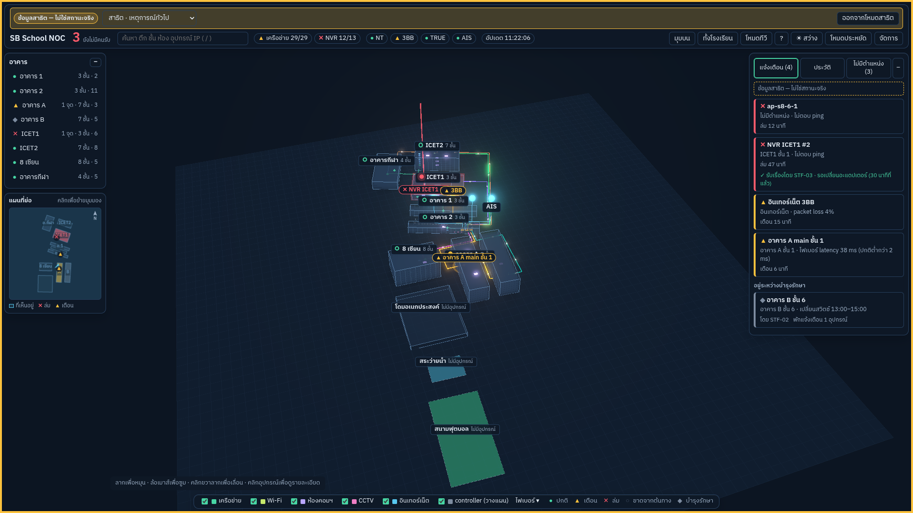
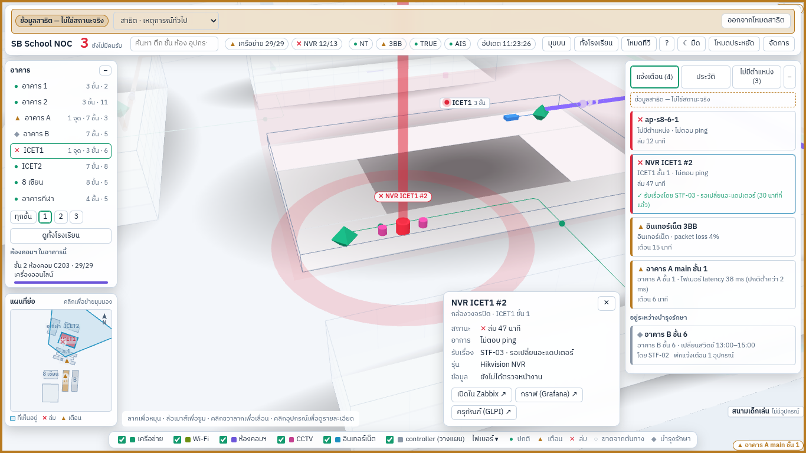
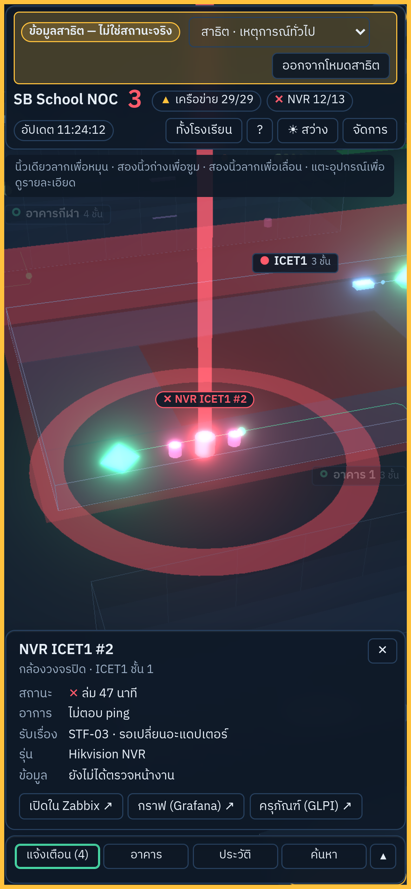

# M22 — E2E + UAT

ตาม modules-by-gate-v2: Playwright ถ่ายภาพ 1366/1920/มือถือ, สคริปต์ UAT, ปุ่มลิงก์ Zabbix/Grafana/GLPI

**เสร็จเมื่อ:** เงื่อนไขปิด G4 ใน baseline ครบ — UAT กับทีมผ่าน, จอทีวี ≥ 30 เฟรม/วินาที, ภาพหน้าจอ 3 ขนาดไม่มีข้อความเลยขอบ

## สิ่งที่ทำ

| ไฟล์                                             | หน้าที่                                                                                                                                                                                                          |
| ------------------------------------------------ | ---------------------------------------------------------------------------------------------------------------------------------------------------------------------------------------------------------------- |
| `packages/shared/src/links.ts`                   | แม่แบบลิงก์ `{code} {name} {hostname} {ip} {loc} {building} {zabbixHostId} {assetTag}` ค่าถูก encode; `A \|\| B` = ใช้ B เมื่อ A ขาดค่า; env ตรวจว่าเป็น http(s) และ placeholder ที่รู้จักเท่านั้น               |
| `apps/api` `GET /config/links`                   | ส่งแม่แบบจาก env `LINK_ZABBIX_URL` `LINK_GRAFANA_URL` `LINK_GLPI_URL` (ไม่ตั้ง = null) — URL สาธารณะเท่านั้น ไม่มี token                                                                                         |
| `packages/shared/src/registry.ts`, `packages/db` | อุปกรณ์ในผังมี `assetTag` (เลขครุภัณฑ์) สำหรับ GLPI                                                                                                                                                              |
| `apps/web` การ์ดรายละเอียด                       | ปุ่ม "เปิดใน Zabbix ↗" "กราฟ (Grafana) ↗" "ครุภัณฑ์ (GLPI) ↗" เปิดแท็บใหม่ (`noopener noreferrer`); ระบบที่ไม่มีแม่แบบหรืออุปกรณ์ขาดค่า → ไม่แสดงปุ่มนั้น; ห้องคอมฯ ใช้ `{loc}` `{name}` ได้                     |
| `tests/e2e/` (`@sbc-noc/e2e`)                    | Playwright 1.63: 3 ขนาด (1920×1080 มืด, 1366×768 สว่าง, 390×844 มือถือ) × 7 หน้า (หน้าจริง, แจ้งเตือน, รายละเอียด + ปุ่มลิงก์, ประวัติ, ค้นหา, วิธีใช้, `/admin/checks`) + โหมดทีวี (fps); ล้มเมื่อข้อความเลยขอบ |
| `tests/e2e/lib/overflow.ts`                      | ตัวตรวจข้อความเลยขอบ: เลยหน้าต่าง, ถูกกล่อง overflow ตัด (เว้นกล่องที่เลื่อนได้และ ellipsis), เผื่อสระ/วรรณยุกต์ไทยแนวตั้ง; มีทดสอบของตัวเอง (`overflow-check.spec.ts`)                                          |
| `.gitea/workflows/build.yml` job `e2e`           | PR เข้า main: image `mcr.microsoft.com/playwright:v1.63.0-noble` + PostgreSQL 16 + Redis, migrate + seed + routes, api `DEMO_MODE`, รัน Playwright, artifact `e2e-shots` (ภาพ + รายงาน) 14 วัน                   |
| `docs/uat/M22-uat.md`                            | สคริปต์ UAT 7 งาน (หาเหตุ → บินไป → รับเรื่อง/ลิงก์ Zabbix → ค้นหา → ประวัติ → ระบบอื่น → มือถือ), วิธีวัด fps บนจอทีวีจริง, แบบบันทึกผล                                                                         |

## ผลตรวจ

- unit: shared 24 (แม่แบบลิงก์ 5), api 31 (`/config/links`, OpenAPI), web 43 (ปุ่มลิงก์ใช้ค่าอุปกรณ์ + fallback, ไม่มีแม่แบบ = ไม่มีปุ่ม); lint/typecheck/depcruise/format ผ่าน
- Playwright บน stack ในเครื่อง (PostgreSQL 16 + seed, Redis, api, vite preview, Chromium + SwiftShader): **22 ผ่าน, 2 ข้าม** (ทีวีเฉพาะ 1920) — ไม่มีข้อความเลยขอบทั้ง 3 ขนาด; ตัวตรวจจับได้ 3/3 กรณีที่ตั้งใจให้ล้น
- fps ใน sandbox = 2 (render ด้วย CPU) จึงไม่บังคับใน CI; เกณฑ์ ≥ 30 ใช้ `E2E_MIN_FPS=30` บนจอจริง (M19 วัดได้ 44 fps)





## ยังไม่ทำ / ข้อสังเกต

- ปิด G4 ต้องรอ **ผู้ใช้** ทำ UAT กับทีม + วัด fps บนจอทีวีจริง ตาม `docs/uat/M22-uat.md` แล้วบันทึกผลที่นี่
- Grafana/GLPI: ยังไม่มี dashboard/URL ที่ยืนยัน — ปุ่มขึ้นเมื่อใส่ `LINK_GRAFANA_URL`/`LINK_GLPI_URL` ใน `dev.env`; GLPI ใช้ `{assetTag}` แต่ทะเบียนยังไม่มีเลขครุภัณฑ์ (ใช้ `{loc}` หรือ `{code}` แทนได้)
- placeholder ช่องค้นหาที่ 1366 ถูกตัดท้าย (เป็นข้อความตัวอย่างใน input ไม่ใช่ข้อมูล) ตัวตรวจไม่นับ
- job `e2e` ยังไม่เป็น required check ของ main — เพิ่มใน branch protection ได้หลังรันผ่านครั้งแรก

## ขั้นตอนบน dev (ผู้ใช้)

1. เพิ่มใน `/opt/sbc-noc/dev.env` (ค่า Zabbix ใช้ได้ทันที):

```bash
cat >> /opt/sbc-noc/dev.env <<'ENV'
LINK_ZABBIX_URL=http://zabbix.sbc.lan/zabbix.php?action=problem.view&filter_set=1&hostids[]={zabbixHostId} || http://zabbix.sbc.lan/zabbix.php?action=host.view&filter_set=1&filter_ip={ip}
LINK_GRAFANA_URL=
LINK_GLPI_URL=
ENV
```

2. ตาม `docs/runbooks/github-to-gitea.md`: ดึง branch `claude/eloquent-johnson-043qwe` เข้า `module/M22-e2e-uat` → PR + CI (ดู job `e2e` และ artifact `e2e-shots`) → merge → อัปเดต dev (ข้อ 3)
3. ตรวจ:

```bash
curl -s http://noc-dev.sbc.lan/api/config/links; echo
```

ควรเห็น `{"zabbix":"http://zabbix.sbc.lan/zabbix.php?…","grafana":null,"glpi":null}`; ในหน้าเว็บ (Ctrl+F5) คลิกอุปกรณ์ที่จับคู่ Zabbix แล้ว → ปุ่ม "เปิดใน Zabbix ↗" เปิดหน้าปัญหาของ host นั้น

4. ทำ UAT ตาม `docs/uat/M22-uat.md` แล้วส่งแบบบันทึกผลกลับมา
